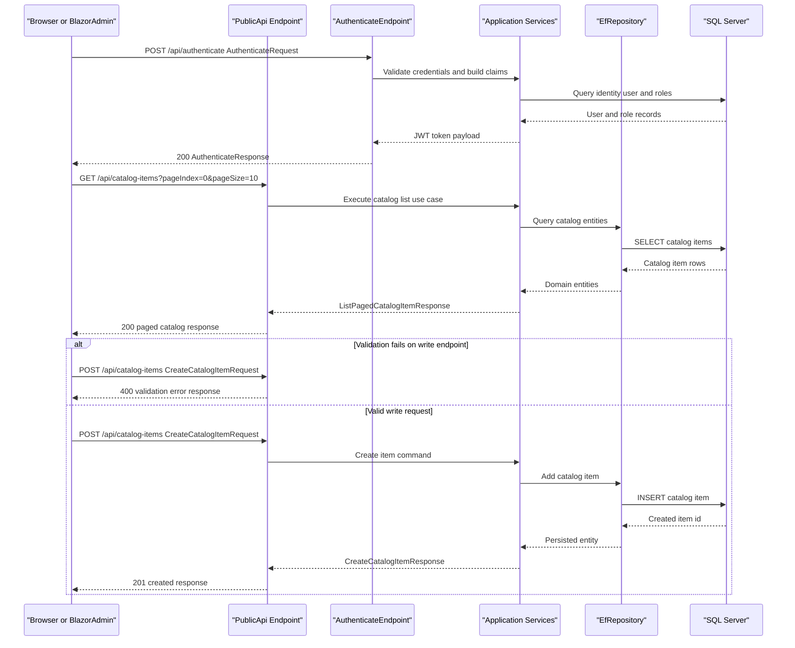

# API & Service Communication Contracts

eShopOnWeb exposes a mixed API surface through MVC controllers and a dedicated PublicApi service with Minimal API endpoints. Communication is predominantly synchronous HTTP with direct in-process service calls and no message-broker-based async contracts detected.

## Service Catalog

| Service | Port | Category | Purpose |
|---|---|---|---|
| Web (src/Web) | 5106 (dev config) | API Layer | Main storefront, account management, checkout UI, and health endpoints |
| PublicApi (src/PublicApi) | 5201 (dev config) | API Layer | Catalog and authentication API for client applications including Blazor admin |
| BlazorAdmin (src/BlazorAdmin) | 5001 (WASM hosted) | Business | Administrative client consuming PublicApi endpoints |
| SQL Server (docker-compose) | 1433 | Infrastructure | Persistence backend for catalog and identity data |

## API Endpoints Inventory

| Service | Method | Path | Request Type | Response Type |
|---|---|---|---|---|
| PublicApi | POST | /api/authenticate | AuthenticateRequest (body) | AuthenticateResponse with JWT token, 200 or error |
| PublicApi | GET | /api/catalog-items | ListPagedCatalogItemRequest (query) | ListPagedCatalogItemResponse, 200 |
| PublicApi | GET | /api/catalog-items/{catalogItemId} | GetByIdCatalogItemRequest (path) | GetByIdCatalogItemResponse, 200 or 404 |
| PublicApi | POST | /api/catalog-items | CreateCatalogItemRequest (body) | CreateCatalogItemResponse, 201 or validation errors |
| PublicApi | PUT | /api/catalog-items | UpdateCatalogItemRequest (body) | UpdateCatalogItemResponse, 200 or validation errors |
| PublicApi | DELETE | /api/catalog-items/{catalogItemId} | DeleteCatalogItemRequest (path) | DeleteCatalogItemResponse, 200 or 404 |
| PublicApi | GET | /api/catalog-brands | none | ListCatalogBrandsResponse, 200 |
| PublicApi | GET | /api/catalog-types | none | ListCatalogTypesResponse, 200 |
| Web | GET | /order and /order/{orderId} | route parameters | HTML views for order listing/details |
| Web | GET or POST | /user and /manage routes | form/query/body models | HTML views or redirects based on auth and model validation |

## Management & Observability Endpoints

| Service | Endpoint | Custom Metrics (if any) |
|---|---|---|
| Web | /health | No custom metrics identified |
| Web | /home_page_health_check | No custom metrics identified |
| Web | /api_health_check | No custom metrics identified |
| PublicApi | /swagger/v1/swagger.json | OpenAPI document generation |
| PublicApi | /swagger | Swagger UI for endpoint exploration |

## DTOs & Contracts

The API contract is defined primarily through `BaseRequest` and `BaseResponse` derivatives in PublicApi (for example `AuthenticateRequest`, `CatalogItemDto`, `ListPagedCatalogItemResponse`, `UpdateCatalogItemRequest`, and `DeleteCatalogItemResponse`). These are service-level API DTOs for request and response payloads. BlazorAdmin uses corresponding client DTO models under `BlazorShared` and HTTP service wrappers as consumer-side contracts. No gateway aggregation DTO layer was detected because there is no separate API gateway component.

Most DTOs are mutable C# classes rather than immutable records. Serialization relies on standard ASP.NET Core JSON behavior (`System.Text.Json`) with Swagger metadata generated via Swashbuckle annotations/configuration.

For entity field-level definitions and persistence mappings, see `data-architecture.md`.

## Communication Patterns

Communication patterns are primarily synchronous:
- HTTP request flows from browser or Blazor client into Web/PublicApi endpoints.
- In-process calls from endpoints/controllers to application services and repositories.
- EF Core synchronous or async database operations to SQL Server.

No asynchronous broker-driven integration (Kafka, RabbitMQ, Azure Service Bus, or background event contracts) was found. No explicit circuit breaker or retry policy libraries (for example Polly) were detected in API-to-API communication; SQL Server transient retry is enabled through EF Core SQL options in Web configuration for production mode.

Service discovery is static configuration based (configured base URLs and direct connection strings) rather than dynamic discovery. Startup order can affect availability in local container scenarios because Web and PublicApi depend on SQL Server being ready.

Security posture:
- PublicApi configures JWT bearer authentication and authorization middleware.
- Web configures cookie authentication and ASP.NET Identity authorization for protected pages.
- HTTPS redirection is enabled in both Web and PublicApi.

## Service Technology Matrix

| Service | Web | Data Access | Discovery | Gateway | Actuator | Cache | Metrics |
|---|---|---|---|---|---|---|---|
| Web | ASP.NET Core MVC and Razor Pages | EF Core (CatalogContext, AppIdentityDbContext) | None | No | Health checks | MemoryCache | Health endpoint status |
| PublicApi | ASP.NET Core Minimal API plus Controllers | EF Core plus repository abstractions | None | No | Swagger endpoints | MemoryCache | Swagger/OpenAPI only |
| BlazorAdmin | Blazor WebAssembly | HttpClient to PublicApi | Static base URL config | No | None | Browser local storage | None |

## Service Communication Sequence

