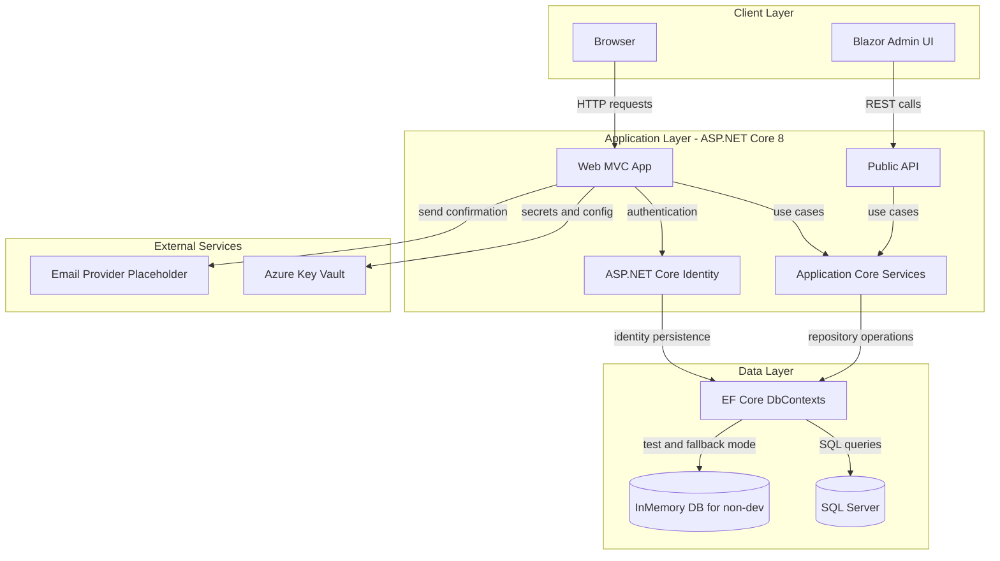
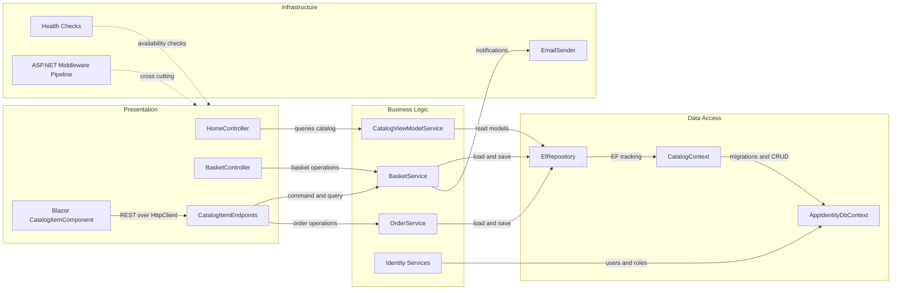

# Architecture Diagram

This document summarizes the current eShopOnWeb architecture and the primary component interactions observed in the repository.

## Application Architecture

### Technology Stack Summary

| Layer | Technology | Version | Purpose |
|---|---|---|---|
| Presentation | ASP.NET Core MVC (Web) | .NET 8 | Server-rendered storefront and account flows |
| Presentation | Blazor WebAssembly (BlazorAdmin) | .NET 8 | Administrative UI for catalog management |
| API | ASP.NET Core Web API (PublicApi) | .NET 8 | Programmatic access to catalog and basket data |
| Business Logic | ApplicationCore + MediatR | .NET 8 | Domain logic, use cases, and abstractions |
| Data Access | EF Core + Repository pattern | EF Core 8 | Data persistence via DbContext and repositories |
| Identity | ASP.NET Core Identity | .NET 8 | User registration, login, and role management |
| Configuration | Azure Key Vault integration | Azure SDK | Secure retrieval of secrets in development mode |

### Data Storage & External Services

The application primarily uses SQL Server through EF Core `CatalogContext` and `AppIdentityDbContext`, with optional in-memory databases for selected environments and tests. The Web project can integrate with Azure Key Vault for secret resolution. Email sending is abstracted behind `IEmailSender` with a placeholder implementation, indicating an external SMTP/transactional mail provider integration point.

### Key Architectural Decisions

- Uses a clean separation between `ApplicationCore` (business logic/contracts) and `Infrastructure` (persistence/identity/service implementations).
- Applies repository and specification patterns for catalog and basket access, reducing direct coupling to EF Core.
- Supports multiple front ends (MVC Web and Blazor Admin) backed by shared core services and a Public API.

## Component Relationships

### Component Inventory

| Component | Layer | Type | Responsibility |
|---|---|---|---|
| HomeController | Presentation | MVC Controller | Handles catalog browsing views and homepage requests |
| BasketController | Presentation | MVC Controller | Manages basket read/update HTTP actions |
| CatalogItemEndpoints | Presentation | API Endpoint Group | Exposes catalog item operations in PublicApi |
| Blazor CatalogItemComponent | Presentation | Blazor Component | Renders and edits catalog item details in admin UI |
| BasketService | Business Logic | Application Service | Coordinates basket domain behavior and persistence |
| OrderService | Business Logic | Application Service | Creates orders from baskets and buyer context |
| CatalogViewModelService | Business Logic | Query Service | Builds catalog view models for UI consumption |
| Identity Services | Business Logic | Identity Service Set | Provides authentication and authorization workflows |
| EfRepository | Data Access | Repository | Generic repository implementation over EF Core |
| CatalogContext | Data Access | DbContext | Persists catalog, basket, buyer, and order entities |
| AppIdentityDbContext | Data Access | Identity DbContext | Persists users, roles, and identity metadata |
| ASP.NET Middleware Pipeline | Infrastructure | Middleware | Cross-cutting request processing, auth, and routing |
| Health Checks | Infrastructure | Health Check Components | Evaluates UI/API health endpoints |
| EmailSender | Infrastructure | Service | Sends account and notification emails through provider abstraction |
