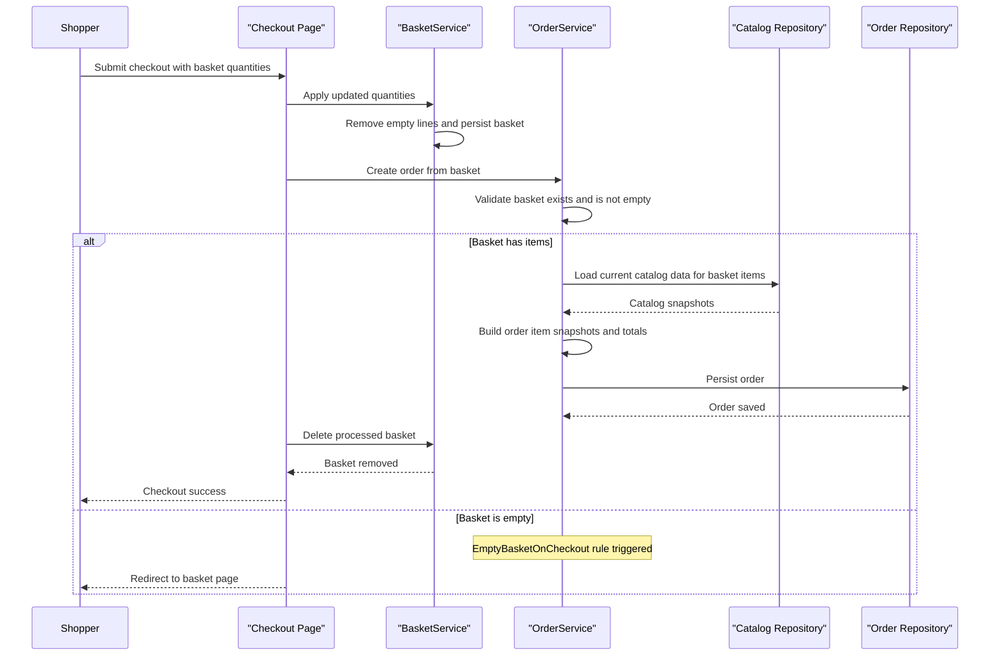

# Core Business Workflows

eShopOnWeb supports an online retail flow where users browse products, manage baskets, authenticate, and complete checkout to create orders. Core business behavior is concentrated in basket and order orchestration services with identity-driven user context.

## Domain Entities

| Entity | Service or Bounded Context | Description | Key Relationships |
|---|---|---|---|
| CatalogItem | Catalog context | Sellable product in the storefront catalog | Linked to CatalogBrand and CatalogType; referenced by basket and order workflows |
| CatalogBrand | Catalog context | Product brand classification | One brand to many catalog items |
| CatalogType | Catalog context | Product category classification | One type to many catalog items |
| Basket | Shopping context | Customer working cart containing intended purchases | Contains BasketItems; linked to buyer identity |
| BasketItem | Shopping context | Individual line item in a basket | References catalog item and quantity decision state |
| Order | Ordering context | Finalized purchase generated at checkout | Contains order items and shipping destination |
| OrderItem | Ordering context | Snapshot of purchased product details and quantity | Belongs to order; captures item identity and pricing snapshot |
| Buyer | Customer context | Authenticated customer identity for purchase ownership | Owns payment methods and references order ownership |
| PaymentMethod | Customer context | Tokenized payment reference metadata | Associated with buyer for payment identity linkage |

## Service-to-Domain Mapping

| Service | Domain Context | Owned Entities | External Dependencies |
|---|---|---|---|
| ApplicationCore BasketService | Shopping | Basket, BasketItem | Repository abstraction and logging adapter |
| ApplicationCore OrderService | Ordering | Order, OrderItem | Basket and catalog repositories plus URI composition service |
| Web storefront | Customer purchase journey | Basket and order view models | ApplicationCore services and identity authentication |
| PublicApi | Catalog management and authentication | Catalog DTO contracts and auth outcomes | Identity services, token claims service, catalog repositories |
| Infrastructure persistence | Shared persistence context | Catalog, Basket, Order, Identity persistence models | SQL and in-memory providers through EF Core |

## Primary Workflows

### Workflow 1: Basket Management and Quantity Adjustment

A shopper adds catalog items to a basket, then adjusts quantities before checkout. The workflow creates a basket if one does not exist for the user, merges repeated items by incrementing quantity, and removes items when quantity becomes zero.

Key steps:
1. User session resolves active basket identity (authenticated username or cookie identity).
2. BasketService loads existing basket or creates a new one.
3. `AddItem` either appends a new basket item or increments an existing line.
4. Quantity update flow applies per-line quantity changes via `SetQuantity`.
5. Empty lines are removed with `RemoveEmptyItems` and basket is persisted.

Business rules involved: quantity cannot be negative, and basket is the source of truth for current checkout intent.

### Workflow 2: Checkout and Order Creation

Checkout converts the active basket into an order. The workflow validates checkout state, creates order line snapshots from current catalog data, and clears the basket on success.

Key steps:
1. Authenticated user submits checkout action.
2. Basket quantities are normalized and persisted.
3. OrderService loads basket with items and validates non-empty basket using `EmptyBasketOnCheckout` guard.
4. Catalog items are fetched to create immutable order snapshots for each basket line.
5. Order is persisted and basket is deleted.
6. User is redirected to success page; if basket is empty, redirect returns to basket page.

Business rules involved: empty basket checkout is blocked; order total is computed from line item quantity multiplied by captured unit price.

### Workflow 3: User Authentication for API and UI Access

User login establishes authenticated identity for both storefront and API consumers. PublicApi can issue JWT tokens after credential validation, while Web uses cookie-based sign-in and authorization for protected pages such as checkout.

Key steps:
1. Credentials are submitted to auth flow.
2. Identity manager validates credentials with lockout-aware behavior.
3. On success, claims token or authenticated session is established.
4. Authenticated state enables protected basket and order workflows.

## Cross-Service Data Flows

Cross-context data flows are primarily synchronous and internally orchestrated. Checkout combines shopping context (basket lines) with catalog context (current product metadata) before writing ordering context entities (order and order items). PublicApi and Web share underlying domain and persistence services rather than distributed remote microservice calls, so data composition happens in-process through repositories and service abstractions.

No circuit-breaker fallback behavior for cross-service remote dependencies was detected because the solution does not implement asynchronous broker workflows or multi-service orchestration over external network boundaries for core purchase flow.

## Business Workflow Sequence

## Business Rules & Decision Logic

- **Validation rules**:
  - Empty basket checkout is rejected by `EmptyBasketOnCheckout` guard.
  - Catalog item updates enforce non-empty name and description and positive price.
  - Basket item quantity must stay within non-negative range.
  - Buyer identity input must be present for buyer creation and basket ownership logic.
- **Decision logic**:
  - Add-item path decides between creating a new basket line or increasing existing quantity.
  - Checkout path branches based on basket emptiness and model validation status.
  - Authentication path branches across success, lockout, not-allowed, and two-factor-required outcomes.
- **State transitions**:
  - Basket evolves through create, add items, update quantities, and delete after successful order creation.
  - Order is created as a committed snapshot at checkout time.
- **Computed values**:
  - Order total is derived from order-item unit price multiplied by units.
  - Basket total items and totals are derived from current basket lines.
- **Authorization and cross-cutting concerns**:
  - Checkout requires authenticated users in Web.
  - Business operations are executed through repository persistence boundaries with exception handling for checkout failures.
