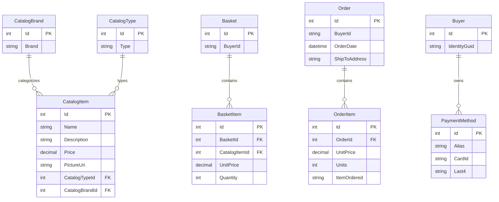

# Data Architecture & Persistence Layer

eShopOnWeb uses EF Core-based persistence across catalog, basket, order, and identity domains with SQL Server as the primary database and in-memory providers for selected environments. The data layer is centered on aggregate roots accessed through repository abstractions and DbContext-backed mappings.

## Database Configuration

| Service or Module | DB Type | Profile | Driver | Connection | Migration Tool |
|---|---|---|---|---|---|
| Infrastructure CatalogContext | SQL Server | Development, Docker, Production | EF Core SqlServer provider | Connection string resolved from runtime config and environment | EF Core migrations in `Infrastructure/Data/Migrations` |
| Infrastructure CatalogContext | InMemory | UseOnlyInMemoryDatabase true | EF Core InMemory provider | Named in-memory store Catalog | Programmatic seed via `CatalogContextSeed` |
| Infrastructure AppIdentityDbContext | SQL Server | Development, Docker, Production | EF Core SqlServer provider | Connection string resolved from runtime config and environment | EF Core migrations in `Infrastructure/Identity/Migrations` |
| Infrastructure AppIdentityDbContext | InMemory | UseOnlyInMemoryDatabase true | EF Core InMemory provider | Named in-memory store Identity | Programmatic seed via `AppIdentityDbContextSeed` |

## Data Ownership per Service

| Service | Tables Owned | ORM Framework | Caching | Notes |
|---|---|---|---|---|
| Infrastructure plus ApplicationCore Catalog domain | CatalogItems, CatalogBrands, CatalogTypes | EF Core via CatalogContext | In-memory app cache in Web and PublicApi | Primary product catalog ownership |
| Infrastructure plus ApplicationCore Basket domain | Baskets, BasketItems | EF Core via CatalogContext | In-memory app cache available | Basket aggregate and item lifecycle |
| Infrastructure plus ApplicationCore Order domain | Orders, OrderItems with owned value objects | EF Core via CatalogContext | In-memory app cache available | Order aggregate persistence and item snapshots |
| Infrastructure Identity domain | Identity users, roles, claims tables | ASP.NET Core Identity plus EF Core | None explicit beyond framework defaults | Authentication and authorization store |

## Entity Model

## Key Repository Methods

| Service | Repository | Notable Methods | Purpose |
|---|---|---|---|
| Infrastructure | `EfRepository<T>` (`src/Infrastructure/Data/EfRepository.cs`) | Inherits Ardalis specification repository methods such as `ListAsync`, `FirstOrDefaultAsync`, `AddAsync`, `UpdateAsync`, `DeleteAsync` | Generic persistence and query execution against `CatalogContext` |
| ApplicationCore Basket | `IRepository<Basket>` (`src/ApplicationCore/Interfaces/IRepository.cs`) | Specification-based read and write operations used by basket service workflows | Basket aggregate retrieval and mutation |
| ApplicationCore Orders | `IRepository<Order>`, `IReadRepository<Order>` | Specification-based loading for order details and user order lists | Order creation and read models |
| Web and PublicApi Catalog | `IRepository<CatalogItem>`, `IRepository<CatalogBrand>`, `IRepository<CatalogType>` | Paged and filtered list retrieval via specifications plus CRUD operations | Catalog browsing and catalog management endpoints |

## Caching Strategy

| Area | Provider | Pattern | TTL or Eviction | Rationale |
|---|---|---|---|---|
| Web application services | ASP.NET Core MemoryCache | Cache-aside for frequently reused in-memory data and framework-level caching | Default process-memory eviction policies | Reduce repeated compute and lookups during web requests |
| PublicApi services | ASP.NET Core MemoryCache | Cache-aside where explicitly used by API service registrations | Default process-memory eviction policies | Improve response times for repeated API reads |
| Data persistence layer | None at ORM second level | Direct repository to database operations | Not applicable | Consistent source-of-truth reads and writes through EF Core |

No Redis, distributed cache, or explicit per-entity TTL strategy was detected.

## Data Ownership Boundaries

The solution mostly uses a shared relational store approach, with domain tables for catalog, basket, order, and identity persisted through separate DbContexts but commonly hosted in the same SQL Server environment. Read and write operations are performed inside the same application boundaries via repository abstractions; cross-service data exchange is predominantly API-based rather than direct database access between independently deployable services.

CQRS is partially present at the application layer through distinct read repository and write repository interfaces plus MediatR query handlers in web-facing code. However, persistence still relies on the same underlying relational store and EF Core model rather than separate read and write databases.

### Data Classification & Sensitivity

| Entity | Sensitive Fields | Classification | Controls in Place |
|---|---|---|---|
| ApplicationUser identity records | Username, email, authentication metadata | PII | ASP.NET Identity framework protections; no explicit field masking shown |
| Order with Address value object | Street, city, state, country, zip code, buyer id linkage | PII | Access gated by authenticated flows; no explicit encryption or masking configuration detected in repository |
| Basket | BuyerId linkage | PII | Application authorization controls; no explicit masking or encryption configuration shown |
| PaymentMethod | Alias, card token reference, last4 | PCI-adjacent tokenized reference | Stores token reference and last4 only; full card number intentionally not stored in domain model |
| Catalog entities | Product metadata and pricing | None | Standard persistence controls |
