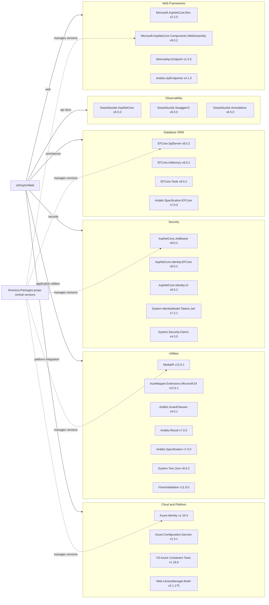

# Dependency Map

This dependency map summarizes declared NuGet dependencies for eShopOnWeb across its .NET solution, using centralized package management. The project declares approximately 36 non-test and 9 test-scoped package dependencies.

## Dependencies

### Dependency Summary

| Category | Count | Key Libraries | Notes |
|---|---:|---|---|
| Web Frameworks | 4 | ASP.NET Core Components, MinimalApi.Endpoint | MVC and Blazor-based web/API surface |
| Database ORM | 4 | EF Core SqlServer, EF Core InMemory | SQL Server primary persistence with in-memory fallback/testing |
| Security | 5 | ASP.NET Core Identity, JwtBearer | Cookie and JWT based auth paths are both present |
| Observability | 3 | Swashbuckle packages | OpenAPI generation and Swagger UI for API inspection |
| Utilities | 7 | MediatR, AutoMapper, Ardalis packages | Core business logic and mapping support libraries |
| Cloud and Platform | 4 | Azure Identity, Key Vault config | Azure secret integration and local build tooling |

### Version & Compatibility Risks

The solution targets .NET 8 and generally uses 8.x framework packages, but several dependencies show modernization risk: `Microsoft.AspNetCore.Mvc` remains on legacy 2.2.0, `System.Text.Json` 8.0.3 is currently flagged by vulnerability advisories, and `Azure.Identity` 1.10.4 has published moderate-severity advisories. These versions should be reviewed during upgrade and security remediation planning.

### Notable Observations

- Central package management via `Directory.Packages.props` helps enforce consistent versions across all projects.
- Both cookie-based Identity UI and JWT bearer authentication libraries are included, indicating mixed auth mechanisms across web and API surfaces.
- EF Core SQL Server and InMemory providers are both declared broadly, supporting production and test or local fallback scenarios.
- Tooling packages such as LibraryManager and code generation dependencies can influence CI reliability even though they are not runtime dependencies.

## Test Dependencies

| Framework | Version | Notes |
|---|---|---|
| Microsoft.NET.Test.Sdk | 17.9.0 | Base test runner SDK across test projects |
| xUnit | 2.7.0 | Primary unit and integration test framework |
| xunit.runner.visualstudio | 2.5.6 | Visual Studio test adapter |
| xunit.runner.console | 2.7.0 | Console test runner support |
| MSTest.TestFramework | 3.2.2 | Used in PublicApiIntegrationTests |
| MSTest.TestAdapter | 3.2.2 | Runner integration for MSTest |
| NSubstitute | 5.1.0 | Mocking library for unit/integration tests |
| NSubstitute.Analyzers.CSharp | 1.0.17 | Analyzer support for NSubstitute usage |
| coverlet.collector | 6.0.2 | Code coverage data collection |

Total test-scope dependencies: 9

The repository has mature test infrastructure with both xUnit and MSTest in use. Mixed frameworks are workable but may increase long-term maintenance overhead for shared test tooling and conventions.
