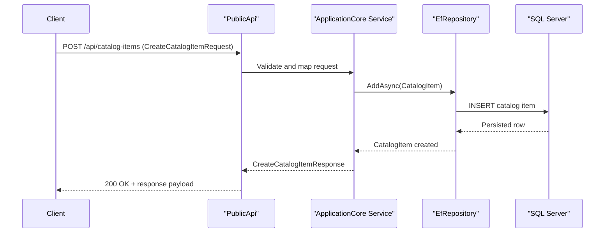

# API & Service Communication Contracts

The solution exposes HTTP contracts primarily through the `PublicApi` project and selected `Web` controllers/pages, with mostly synchronous request-response interactions over HTTPS.

## Service Catalog

| Service | Port | Category | Purpose |
|---|---|---|---|
| Web | 44315 (from appsettings base URL) | API Layer | Customer-facing storefront UI and authenticated checkout workflow |
| PublicApi | 5099 (from appsettings base URL) | API Layer | Programmatic catalog/auth endpoints for web and admin clients |
| BlazorAdmin | Uses Web/PublicApi base URLs | Business | Admin experience for catalog maintenance via API |
| ApplicationCore | N/A (library) | Business | Domain services and business rules |
| Infrastructure | N/A (library) | Infrastructure | EF Core persistence and identity data access |

## API Endpoints Inventory

| Service | Method | Path | Request Type | Response Type |
|---|---|---|---|---|
| PublicApi | GET | `/api/catalog-items` | Query params: `pageSize,pageIndex,catalogBrandId,catalogTypeId` | `ListPagedCatalogItemResponse` |
| PublicApi | GET | `/api/catalog-items/{catalogItemId}` | Path param: `catalogItemId` | `GetByIdCatalogItemResponse` |
| PublicApi | POST | `/api/catalog-items` | `CreateCatalogItemRequest` | `CreateCatalogItemResponse` |
| PublicApi | PUT | `/api/catalog-items` | `UpdateCatalogItemRequest` | `UpdateCatalogItemResponse` |
| PublicApi | DELETE | `/api/catalog-items/{catalogItemId}` | Path param: `catalogItemId` | `DeleteCatalogItemResponse` |
| PublicApi | GET | `/api/catalog-brands` | None | `ListCatalogBrandsResponse` |
| PublicApi | GET | `/api/catalog-types` | None | `ListCatalogTypesResponse` |
| PublicApi | POST | `/api/authenticate` | `AuthenticateRequest` | `AuthenticateResponse` |
| Web | GET | `/Order/MyOrders` | Authenticated user context | View model of orders |
| Web | GET | `/Order/Detail/{orderId}` | Path param: `orderId` | View model of order details |

## Management & Observability Endpoints

| Service | Endpoint | Custom Metrics (if any) |
|---|---|---|
| Web | `/health` | None detected |
| Web | `/home_page_health_check` | None detected |
| Web | `/api_health_check` | None detected |
| PublicApi | `/swagger/v1/swagger.json`, `/swagger` | None detected |

## DTOs & Contracts

Public API contracts are defined as dedicated request/response classes (`CreateCatalogItemRequest`, `ListPagedCatalogItemResponse`, `AuthenticateResponse`, etc.), while domain entities (`CatalogItem`, `Order`, `Basket`) remain internal to service layers and repositories. DTOs are mutable C# classes rather than immutable records. Serialization uses the default ASP.NET Core JSON stack, and OpenAPI contracts are exposed via Swashbuckle configuration.

## Communication Patterns

Communication is predominantly synchronous HTTP between clients and `PublicApi`/`Web`. Within the backend, application services call repositories directly (in-process library boundaries). No asynchronous messaging broker patterns were found. Retry behavior is enabled for SQL Server connections in production configuration (`EnableRetryOnFailure`). Service discovery is not used; services are configured through explicit base URLs. API-level security includes ASP.NET Identity cookies (Web) and JWT bearer authentication setup (PublicApi), but TLS termination/deployment specifics are environment-dependent.

## Service Technology Matrix

| Service | Web | Data Access | Discovery | Gateway | Actuator | Cache | Metrics |
|---|---|---|---|---|---|---|---|
| Web | ASP.NET MVC/Razor | EF Core via Infrastructure | None | No | HealthChecks | IMemoryCache | Built-in logging only |
| PublicApi | Minimal APIs + Controllers | EF Core via Infrastructure | None | No | Swagger endpoints | IMemoryCache | Built-in logging only |
| BlazorAdmin | Blazor WebAssembly | Calls PublicApi | None | No | None | Browser local storage cache | None detected |

## Service Communication Sequence

