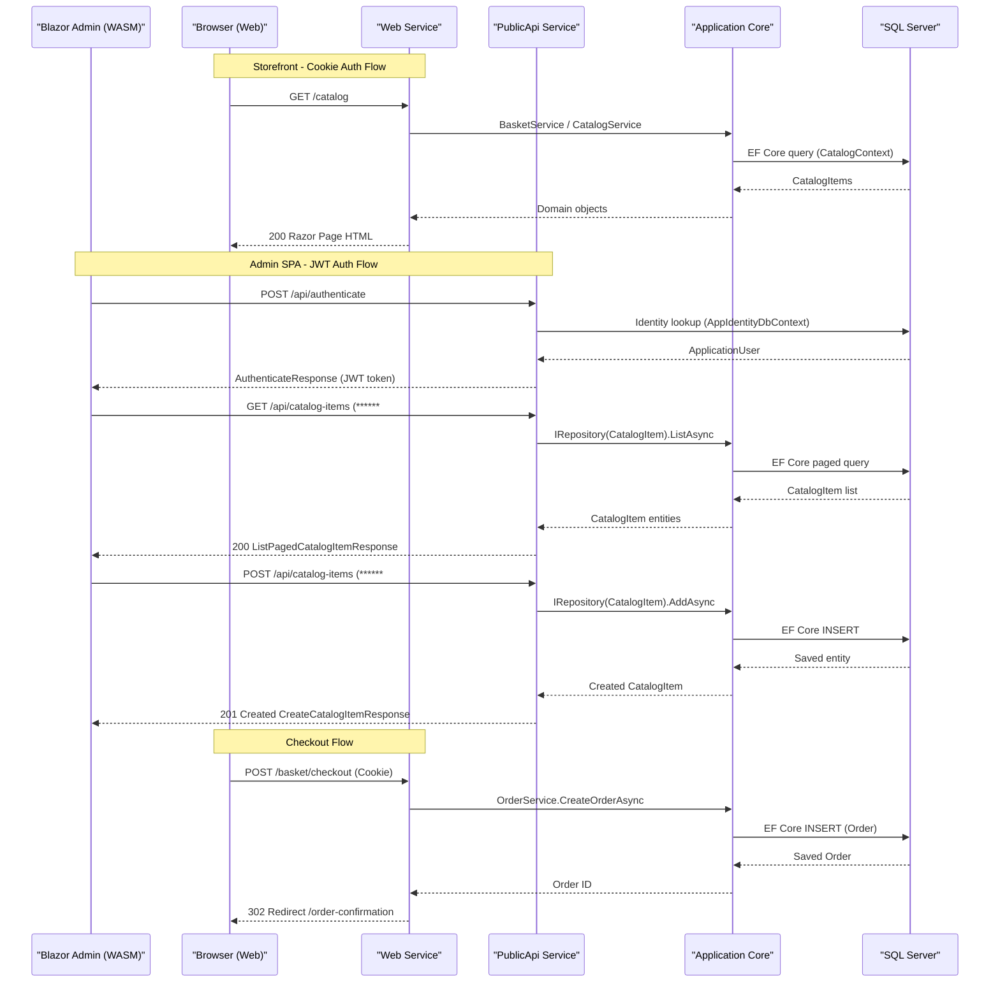

# API & Service Communication Contracts

The eShopOnWeb solution exposes two HTTP entry points: a server-rendered web application (MVC/Razor Pages) and a Swagger-documented REST API (PublicApi), together providing approximately 15 REST endpoints for authentication, catalog management, basket, and order operations.

## Service Catalog

| Service | Port | Category | Purpose |
|---|---|---|---|
| Web (eshopwebmvc) | 44315 (HTTPS dev) / 5001 | API Layer + Business | Server-rendered storefront; cookie-auth MVC/Razor Pages; exposes internal API controllers for basket and order |
| PublicApi (eshoppublicapi) | 5099 (HTTPS dev) | API Layer | Swagger-documented REST API consumed by Blazor Admin SPA; JWT-authenticated |
| SQL Server (sqlserver) | 1433 | Infrastructure | Azure SQL Edge container providing Catalog and Identity databases |

## API Endpoints Inventory

### PublicApi Service

| Method | Path | Request Type | Response Type | Auth |
|---|---|---|---|---|
| POST | /api/authenticate | AuthenticateRequest (username, password) | AuthenticateResponse (token, result flags) | None (login) |
| GET | /api/catalog-items | Query params: pageSize, pageIndex, catalogBrandId, catalogTypeId | ListPagedCatalogItemResponse (items, pageCount) | JWT ******
| GET | /api/catalog-items/{catalogItemId} | Path param: catalogItemId (int) | GetByIdCatalogItemResponse (CatalogItemDto) | JWT ******
| POST | /api/catalog-items | CreateCatalogItemRequest (name, description, price, pictureBase64, brandId, typeId) | CreateCatalogItemResponse (201 Created) | JWT ******
| PUT | /api/catalog-items | UpdateCatalogItemRequest (id, name, description, price, pictureUri, brandId, typeId) | UpdateCatalogItemResponse | JWT ******
| DELETE | /api/catalog-items/{catalogItemId} | Path param: catalogItemId (int) | DeleteCatalogItemResponse (204 No Content) | JWT ******
| GET | /api/catalog-brands | None | CatalogBrandListResponse (brands list) | JWT ******
| GET | /api/catalog-types | None | CatalogTypeListResponse (types list) | JWT ******

### Web Service (MVC / Razor Pages internal API controllers)

| Method | Path | Request Type | Response Type | Auth |
|---|---|---|---|---|
| GET | /user | None | UserInfo view | Cookie |
| POST | /user/logout | None | Redirect | Cookie |
| GET/POST | /manage/* | Various account management forms | Razor views | Cookie |
| GET | /order | None | Order list Razor view | Cookie |

## Management & Observability Endpoints

| Service | Endpoint | Purpose / Custom Metrics |
|---|---|---|
| Web | /health | Aggregated JSON health status (custom ApiHealthCheck + HomePageHealthCheck) |
| Web | /home_page_health_check | Dedicated Razor Pages homepage health check |
| Web | /api_health_check | Dedicated external API reachability check |
| PublicApi | /swagger | Swagger UI (development only) |
| PublicApi | /swagger/v1/swagger.json | OpenAPI v1 JSON spec |

No Prometheus metrics endpoint or Application Insights instrumentation was detected.

## DTOs & Contracts

All API contracts are service-level classes (not gateway aggregation DTOs); each endpoint owns its own request/response pair:

- **AuthenticateRequest / AuthenticateResponse** — login request and JWT token response; mutable C# class with `CorrelationId()` helper from `BaseRequest`
- **ListPagedCatalogItemRequest / ListPagedCatalogItemResponse** — query params mapped to a paged list of `CatalogItemDto`; mutable class
- **GetByIdCatalogItemRequest / GetByIdCatalogItemResponse** — single item retrieval by integer ID
- **CreateCatalogItemRequest / CreateCatalogItemResponse** — catalog item creation; accepts `pictureBase64` image upload as string
- **UpdateCatalogItemRequest / UpdateCatalogItemResponse** — full item update with picture URI
- **DeleteCatalogItemRequest / DeleteCatalogItemResponse** — delete by ID
- **CatalogItemDto** — AutoMapper-projected read model shared across list and get responses; contains id, name, description, price, pictureUri, catalogBrandId, catalogTypeId
- **CatalogBrandListResponse / CatalogTypeListResponse** — simple list wrappers for reference data

OpenAPI documentation is generated at runtime by **Swashbuckle.AspNetCore 6.5.0**. No `.proto` files or GraphQL schema files were found. Serialization uses the default `System.Text.Json` pipeline; no custom converters were detected.

## Communication Patterns

**Synchronous REST**: All inter-process communication is synchronous HTTP/HTTPS REST. The Blazor Admin WebAssembly client calls the `PublicApi` service directly using `HttpClient`; no API gateway or service mesh is present.

**No asynchronous messaging**: No Kafka, RabbitMQ, Azure Service Bus, or any other message broker is present in the solution.

**No circuit breaker or retry policies**: No Polly, Resilience4j, or equivalent resilience library is declared. EF Core's `EnableRetryOnFailure()` is configured in the production code path (`Program.cs`) to handle transient SQL Server failures, which is the only resilience mechanism.

**Service discovery**: Services reference each other by hardcoded base URLs configured in `appsettings.json` (`baseUrls.apiBase`, `baseUrls.webBase`). No Consul, Eureka, or Kubernetes DNS-based discovery is used.

**Startup dependency chain**: Both `eshopwebmvc` and `eshoppublicapi` containers declare `depends_on: sqlserver` in `docker-compose.yml`, ensuring SQL Server starts before the application containers. No health-check-based wait mechanism (e.g., `condition: service_healthy`) is configured, so race conditions on SQL Server readiness are possible in Docker.

**Security posture**: 
- The `Web` service authenticates users with **cookie-based authentication** (HttpOnly, Secure, SameSite=Lax) backed by ASP.NET Core Identity. HTTPS is enforced via `UseHsts` and `UseHttpsRedirection`.
- The `PublicApi` service uses **JWT ****** (`Microsoft.AspNetCore.Authentication.JwtBearer`). All catalog and management endpoints require a valid JWT obtained from `POST /api/authenticate`. Swagger UI is exposed only in development.
- Authorization on `PublicApi` endpoints uses `[Authorize]` attributes with admin-role requirements on write operations.
- The `/health` endpoint on the `Web` service is publicly accessible with no authentication.

## Service Technology Matrix

| Service | Web Framework | Data Access | Discovery | Gateway | Health Checks | Cache | Metrics |
|---|---|---|---|---|---|---|---|
| Web | ASP.NET Core MVC + Razor Pages 8.0.2 | EF Core 8 (SQL Server) | None (hardcoded URLs) | No | Yes (/health, custom) | In-Memory (AddMemoryCache) | None |
| PublicApi | ASP.NET Core Minimal API + Ardalis.ApiEndpoints 4.1.0 | EF Core 8 (SQL Server) | None (hardcoded URLs) | No | No | None | None |
| Blazor Admin | Blazor WebAssembly 8.0.2 | Via PublicApi REST | N/A | N/A | N/A | Blazored.LocalStorage | None |

## Service Communication Sequence

