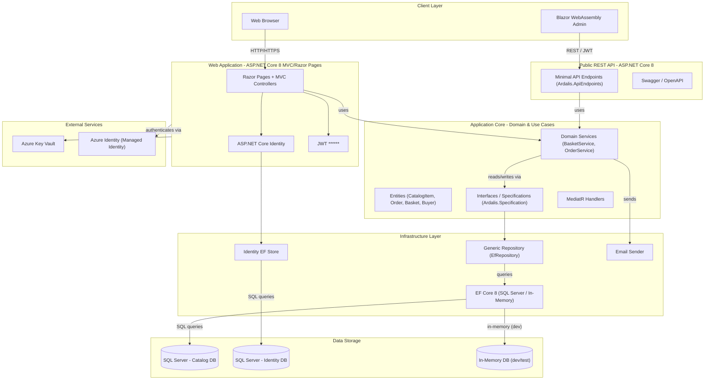
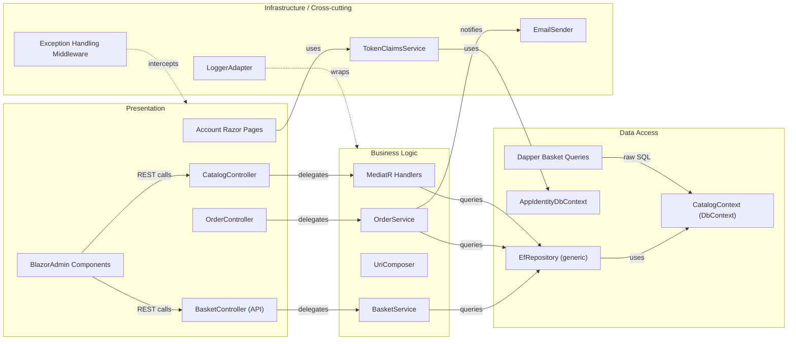

# Architecture Diagram

eShopOnWeb is an ASP.NET Core 8 reference application implementing a layered, clean-architecture e-commerce platform with a Razor Pages / MVC web front-end, a Blazor WebAssembly admin panel, and a REST API back-end.

## Application Architecture

### Technology Stack Summary

| Layer | Technology | Version | Purpose |
|---|---|---|---|
| Presentation (Web) | ASP.NET Core MVC + Razor Pages | 8.0.2 | Server-rendered web storefront |
| Presentation (Admin) | Blazor WebAssembly | 8.0.2 | SPA admin panel |
| REST API | ASP.NET Core + Ardalis.ApiEndpoints | 8.0 / 4.1.0 | Public catalog & basket API |
| Application Core | C# class library + MediatR | net8.0 / 12.0.1 | Domain entities, services, interfaces |
| ORM / Data Access | Entity Framework Core 8 (SQL Server) | 8.0.2 | Database persistence |
| Identity | ASP.NET Core Identity + EF | 8.0.2 | Authentication & authorization |
| Repository | Ardalis.Specification.EntityFrameworkCore | 7.0.0 | Generic repository pattern |
| Configuration Secrets | Azure Key Vault | 1.3.1 | Production secrets management |
| API Documentation | Swashbuckle / OpenAPI | 6.5.0 | Swagger UI for REST API |

### Data Storage & External Services

The application uses Microsoft SQL Server as its primary data store, with two separate databases: a **Catalog DB** holding products, orders, and basket data (via `CatalogContext`), and an **Identity DB** holding ASP.NET Core Identity users and roles (via `AppIdentityDbContext`). An **In-Memory EF Core** provider is available for development and testing, removing the need for a local SQL Server instance. For configuration secrets in production, the application integrates with **Azure Key Vault** using **Azure Managed Identity** via `Azure.Identity` and `Azure.Extensions.AspNetCore.Configuration.Secrets`.

### Key Architectural Decisions

- **Clean Architecture with Repository pattern**: Domain entities and interfaces live in `ApplicationCore`; all infrastructure concerns (EF Core, email, identity) are in `Infrastructure`, keeping the domain layer free of framework dependencies.
- **Dual-entry-point design**: A traditional Razor Pages/MVC `Web` project serves the storefront, while a separate `PublicApi` ASP.NET Core project exposes a Swagger-documented REST API consumed by the Blazor Admin SPA.
- **Ardalis.Specification** is used for query composition, allowing reusable, testable filter/sort specifications to be passed to the generic `EfRepository<T>` without leaking EF concerns into the domain layer.

## Component Relationships

### Component Inventory

| Component | Layer | Type | Responsibility |
|---|---|---|---|
| CatalogController | Presentation | MVC Controller | Handles catalog browsing and search requests |
| OrderController | Presentation | MVC Controller | Displays order history for authenticated users |
| BasketController (API) | Presentation | API Controller | REST endpoints for basket CRUD |
| Account Razor Pages | Presentation | Razor Pages | Login, register, manage account |
| BlazorAdmin Components | Presentation | Blazor WASM | Admin UI for catalog management |
| BasketService | Business Logic | Domain Service | Manages shopping basket add/remove/update logic |
| OrderService | Business Logic | Domain Service | Creates orders from basket, sends confirmation email |
| UriComposer | Business Logic | Service | Builds catalog image URIs from base URL config |
| MediatR Handlers | Business Logic | CQRS Handlers | Processes catalog read/write commands and queries |
| EfRepository | Data Access | Repository | Generic EF Core repository implementing IRepository |
| CatalogContext | Data Access | DbContext | EF Core context for catalog, orders, baskets |
| AppIdentityDbContext | Data Access | DbContext | EF Core context for ASP.NET Core Identity |
| DapperBasketQueries | Data Access | Query Service | Raw Dapper SQL for basket read-side queries |
| LoggerAdapter | Infrastructure | Cross-cutting | IAppLogger wrapper over ILogger |
| EmailSender | Infrastructure | Cross-cutting | Sends order confirmation emails |
| TokenClaimsService | Infrastructure | Cross-cutting | Issues JWT tokens for API authentication |
| Exception Middleware | Infrastructure | Middleware | Catches and formats unhandled exceptions |
