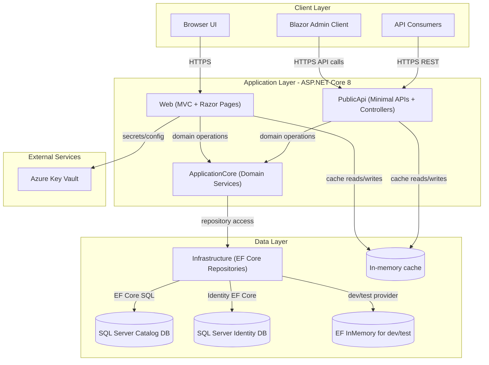
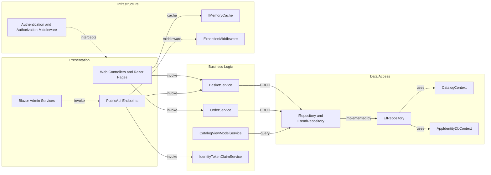

# Architecture Diagram

This repository contains a modular .NET e-commerce application with separate web UI, public API, core domain, infrastructure, and Blazor admin front-end projects.

## Application Architecture

### Technology Stack Summary

| Layer | Technology | Version | Purpose |
|---|---|---|---|
| Presentation | ASP.NET Core MVC, Razor Pages, Blazor | 8.0.x | Web storefront and admin UI |
| API | ASP.NET Core Minimal APIs + Controllers, Swagger | 8.0.x | External/service API surface |
| Business Logic | ApplicationCore services + specifications | Custom + Ardalis libs | Domain rules for basket, catalog, order |
| Data Access | EF Core + generic repository | 8.0.2 | Persistence abstraction and database access |
| Identity/Security | ASP.NET Core Identity + JWT bearer | 8.0.2 | Authentication and authorization support |

### Data Storage & External Services

The application primarily uses SQL Server for catalog and identity data, with EF InMemory used for local/test scenarios. Runtime caching is in-memory. In non-development environments, configuration and connection secrets can be sourced from Azure Key Vault.

### Key Architectural Decisions

- Uses a layered architecture with `ApplicationCore` isolated from web/API presentation concerns.
- Applies repository + specification patterns (`IRepository`, `IReadRepository`, Ardalis.Specification) for data querying.
- Supports multiple front-ends (MVC web and Blazor admin) over shared domain and infrastructure components.

## Component Relationships

### Component Inventory

| Component | Layer | Type | Responsibility |
|---|---|---|---|
| OrderController / Checkout page model | Presentation | MVC Controller / Razor Page | Handles order placement and checkout flow |
| Catalog item endpoints | Presentation | Minimal API endpoints | CRUD/list/read operations for catalog API |
| AuthenticateEndpoint | Presentation | API Controller | Issues JWT claims for authenticated users |
| BasketService | Business Logic | Domain service | Creates, updates, transfers, and deletes baskets |
| OrderService | Business Logic | Domain service | Creates orders from basket state |
| EfRepository | Data Access | Repository implementation | Generic data operations over EF Core |
| CatalogContext | Data Access | EF Core DbContext | Catalog, basket, order aggregate persistence |
| AppIdentityDbContext | Data Access | Identity DbContext | User and role persistence |
| ExceptionMiddleware | Infrastructure | Middleware | API exception handling and translation |
