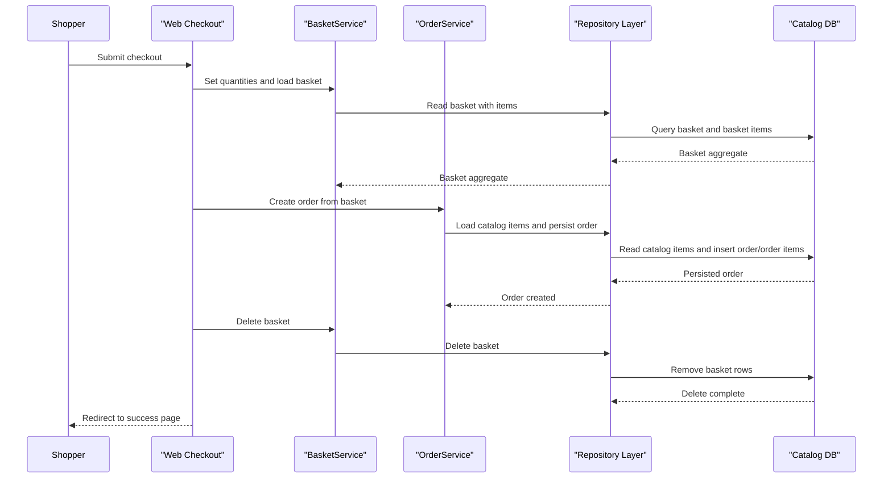

# Core Business Workflows

The application implements online storefront workflows for browsing products, managing a basket, and converting basket contents into customer orders.

## Domain Entities

| Entity | Service / Bounded Context | Description | Key Relationships |
|---|---|---|---|
| CatalogItem | Catalog | Sellable product with brand/type classification | Belongs to CatalogBrand and CatalogType |
| CatalogBrand | Catalog | Product brand taxonomy | One-to-many with CatalogItem |
| CatalogType | Catalog | Product type taxonomy | One-to-many with CatalogItem |
| Basket | Shopping | Customer shopping basket | Owns many BasketItem entries |
| BasketItem | Shopping | Line item in basket | References a CatalogItem |
| Order | Ordering | Finalized customer purchase | Owns many OrderItem entries |
| OrderItem | Ordering | Immutable purchased line item snapshot | Derived from CatalogItem and basket state |

## Service-to-Domain Mapping

| Service | Domain Context | Owned Entities | External Dependencies |
|---|---|---|---|
| Web | Shopping + Ordering UX | Basket, Order (through services) | ApplicationCore services, Infrastructure repositories |
| PublicApi | Catalog + Auth API | Catalog entities (through services/repositories) | Infrastructure repositories, identity services |
| ApplicationCore | Domain logic | Basket and Order business operations | Repository abstractions, URI composition |
| Infrastructure | Persistence + Identity | Catalog/Order schema + identity schema | EF Core, SQL Server/InMemory providers |

## Primary Workflows

### Workflow 1: Add Item to Basket

Entry points in storefront/API invoke `BasketService.AddItemToBasket`. The service loads an existing basket by buyer identity, creates one when absent, appends or updates line items, and persists updated basket state.

### Workflow 2: Checkout and Create Order

Authenticated checkout (`Basket/Checkout`) validates basket state and quantities, then calls `OrderService.CreateOrderAsync`. The service loads catalog item snapshots for current basket items, creates order items, persists the order aggregate, and finally removes the basket.

### Workflow 3: Browse and Maintain Catalog

Catalog list/detail endpoints read filtered or paginated product data; admin operations create/update/delete catalog items through API requests and repository persistence.

## Cross-Service Data Flows

The Web and BlazorAdmin front-ends consume `PublicApi` for catalog/auth operations. Within backend boundaries, `PublicApi` and Web workflows share `ApplicationCore` and `Infrastructure` components in-process. Catalog-to-order flow composes basket quantities with current catalog item metadata to produce immutable order snapshots.

## Business Workflow Sequence

## Business Rules & Decision Logic

- Basket creation is lazy: a basket is created only when a user first adds an item.
- Checkout enforces non-empty basket rule (`EmptyBasketOnCheckoutException`) before order creation.
- Order creation snapshots catalog item identity/name/picture and unit prices at checkout time.
- Basket quantity updates remove empty line items before persistence.
- Authorization gates checkout and order history access to authenticated users.
