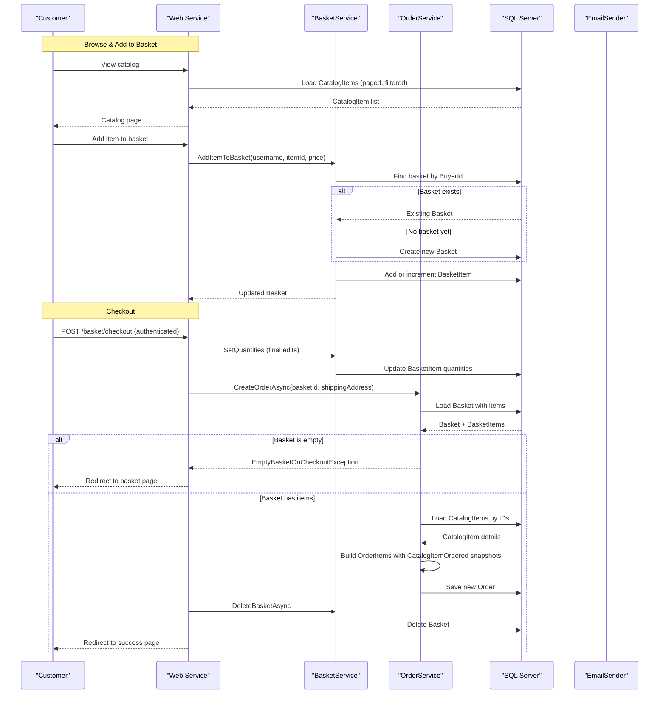

# Core Business Workflows

eShopOnWeb is an online retail storefront that allows customers to browse a product catalog, manage a shopping basket, and place orders, while providing administrators with catalog management capabilities through a Blazor WebAssembly admin panel.

## Domain Entities

| Entity | Service / Bounded Context | Description | Key Relationships |
|---|---|---|---|
| CatalogItem | Catalog Management | A product available for purchase, with name, description, price, and image | Belongs to one CatalogBrand and one CatalogType |
| CatalogBrand | Catalog Management | A product brand classification | Contains many CatalogItems |
| CatalogType | Catalog Management | A product type/category | Contains many CatalogItems |
| Basket | Shopping Basket | A buyer's in-progress shopping cart, identified by buyer ID (username or anonymous cookie) | Contains many BasketItems |
| BasketItem | Shopping Basket | A line item in a basket referencing a CatalogItem by ID with quantity and locked unit price | Belongs to one Basket |
| Order | Order Management | A confirmed purchase placed by a buyer with a shipping address and items | Contains many OrderItems |
| OrderItem | Order Management | An immutable snapshot of an ordered product (CatalogItemOrdered value object) with quantity and price at time of purchase | Belongs to one Order |
| CatalogItemOrdered | Order Management | Value object snapshot of the catalog item at point of order (id, name, picture URI) — insulated from future catalog changes | Embedded in OrderItem |
| Buyer | Customer Management | A registered buyer identified by ASP.NET Identity GUID | Has many PaymentMethods |
| PaymentMethod | Customer Management | A tokenized payment reference (alias, card token, last-4 digits) | Belongs to one Buyer |

## Service-to-Domain Mapping

| Service | Domain Context | Owned Entities | External Dependencies |
|---|---|---|---|
| Web (MVC/Razor Pages) | Storefront: Catalog browsing, basket management, order placement | Reads CatalogItem, CatalogBrand, CatalogType; writes Basket, BasketItem, Order, OrderItem | ASP.NET Core Identity (via Infrastructure) for user auth |
| PublicApi (REST) | Catalog Administration API | Reads/writes CatalogItem, CatalogBrand, CatalogType | ASP.NET Core Identity for JWT issuance |
| Infrastructure (shared) | Persistence & Identity | All entities via EfRepository; ASP.NET Identity tables | SQL Server / In-Memory EF |
| BlazorAdmin (WASM client) | Catalog Administration UI | No direct DB ownership — reads/writes via PublicApi REST | PublicApi service over HTTPS |

All services share the same physical databases (`CatalogContext` and `AppIdentityDbContext`) deployed within the same process. There is no event-driven or message-based inter-service communication.

## Primary Workflows

### Workflow 1: Browse Catalog and Add to Basket

A user (anonymous or authenticated) browses the product catalog and adds items to a basket.

1. **Load catalog**: The storefront home page (`/`) renders a paged list of `CatalogItem`s filtered by optional brand and type. Catalog brands and types are served from the in-process memory cache (30-second sliding window) via `CachedCatalogViewModelService` to reduce database reads.
2. **Resolve buyer identity**: If the user is authenticated (cookie session), their username serves as the `BuyerId`. For anonymous users, a GUID stored in a long-lived browser cookie (10-year expiry) is used.
3. **Add to basket**: Submitting the product detail form calls `BasketService.AddItemToBasket`. If no basket exists for the buyer, a new one is created. If the catalog item is already in the basket, its quantity is incremented; otherwise a new `BasketItem` is added with the current catalog price locked at add time.
4. **View and update basket**: The basket page (`/basket`) shows all items. The user can update quantities; `BasketService.SetQuantities` applies changes and calls `RemoveEmptyItems()` to purge zero-quantity lines.

### Workflow 2: Checkout and Place Order

An authenticated user completes checkout and converts their basket into an order.

1. **Authentication gate**: The `/basket/checkout` page is decorated with `[Authorize]` — unauthenticated users are redirected to the login page.
2. **Basket transfer (anonymous → authenticated)**: When an anonymous user logs in, `BasketService.TransferBasketAsync` merges their cookie-identified basket into their authenticated basket, then deletes the anonymous basket.
3. **Update final quantities**: On checkout POST, the user's last quantity edits are applied via `BasketService.SetQuantities`.
4. **Guard: non-empty basket**: `OrderService.CreateOrderAsync` calls `Guard.Against.EmptyBasketOnCheckout(basket.Items)`. If the basket is empty (e.g., all items removed), an `EmptyBasketOnCheckoutException` is thrown; the checkout page catches it and redirects back to `/basket`.
5. **Create order**: `OrderService.CreateOrderAsync` loads the basket items, fetches current `CatalogItem` records to resolve item names and picture URIs, then constructs an `Order` with `OrderItem` entries. Each `OrderItem` contains a `CatalogItemOrdered` value object — a point-in-time snapshot protecting the order from future catalog changes. The price stored in `OrderItem.UnitPrice` is taken from `BasketItem.UnitPrice` (price at time of add to basket).
6. **Persist order and clear basket**: The order is saved via `IRepository<Order>.AddAsync`. The basket is then deleted via `BasketService.DeleteBasketAsync`.
7. **Redirect to success**: The user is redirected to `/basket/success`.

### Workflow 3: Admin Catalog Management (Blazor Admin)

An administrator manages the product catalog via the Blazor Admin SPA.

1. **Authenticate via JWT**: The admin user calls `POST /api/authenticate` with credentials. The `PublicApi` validates credentials via `SignInManager` and returns a JWT token via `TokenClaimsService`.
2. **Browse catalog items**: The SPA calls `GET /api/catalog-items` with paging and filter parameters. Reference data (brands, types) is cached in browser local storage via `CachedCatalogItemServiceDecorator`.
3. **Create/update/delete catalog items**: Admin mutations go through `POST`, `PUT`, or `DELETE /api/catalog-items` endpoints. Image uploads are sent as Base64-encoded strings in the request body; the API stores the image and updates `PictureUri`.
4. **Authorization**: Write endpoints on `PublicApi` require an admin role claim in the JWT. The `TokenClaimsService` embeds role claims into the token at issue time.

## Cross-Service Data Flows

The application uses a **monolithic deployment** with no runtime inter-service HTTP calls for domain data. All data access from both `Web` and `PublicApi` goes directly to the shared SQL Server databases through `EfRepository<T>`.

The only client-to-server HTTP flow for business data is:
- **Blazor Admin SPA → PublicApi**: The WASM client fetches and mutates catalog data via REST. No aggregation across multiple backend services occurs — all catalog data is in a single `CatalogContext`.
- **Anonymous basket merge**: When a user logs in, their anonymous basket (identified by GUID cookie) is loaded from the database and merged into their authenticated basket in a single `TransferBasketAsync` transaction within the `Web` service. The anonymous basket is then deleted.

There are no circuit breaker fallback flows because all in-process service calls share the same database connection and failure domain.

## Business Workflow Sequence

## Business Rules & Decision Logic

### Validation Rules

- **Basket items**: Quantity must be `>= 0` (via `Guard.Against.OutOfRange`); zero-quantity items are removed by `RemoveEmptyItems()` before checkout.
- **Order creation**: Buyer ID must not be null or empty. `CatalogItemOrdered` requires `catalogItemId >= 1`, non-empty `productName`, and non-empty `pictureUri`.
- **Catalog item updates**: Name and description must not be empty; price must be positive (`Guard.Against.NegativeOrZero`).
- **Checkout authorization**: The `/basket/checkout` page requires `[Authorize]` — anonymous checkout is not permitted.
- **Empty basket guard**: `Guard.Against.EmptyBasketOnCheckout` throws `EmptyBasketOnCheckoutException` if all items have been removed before order creation.

### Decision Logic

- **Anonymous vs authenticated basket identity**: If the user has an active cookie session, their username is the `BuyerId`; otherwise a GUID from a browser cookie is used. This allows pre-login basket accumulation.
- **Price locking**: The `UnitPrice` on `BasketItem` is set when the item is added to the basket, not when the order is created. Order items carry this locked price, protecting against catalog price changes between add and checkout.
- **CatalogItemOrdered snapshot**: At order creation, current catalog item name and picture URI are copied into `CatalogItemOrdered`. Future changes to the catalog item do not retroactively affect order history.
- **Shipping address hardcoded**: The current checkout implementation passes a hardcoded address (`"123 Main St., Kent, OH"`) — no address capture form is implemented.

### State Transitions

- **Basket lifecycle**: Created (first item added) → Updated (item add/remove/quantity change) → Deleted (after successful checkout or explicit deletion).
- **Order lifecycle**: Created (via `OrderService.CreateOrderAsync`) — no further state transitions are modeled (no `Shipped`, `Delivered`, or `Cancelled` states).

### Cross-Cutting Concerns

- **Transactions**: No explicit `TransactionScope` or `SaveChanges` transaction boundaries beyond EF Core's implicit per-`SaveChanges` transaction. Order creation and basket deletion are separate repository calls without a distributed transaction — a failure between them could leave an orphaned basket.
- **Error handling**: `EmptyBasketOnCheckoutException` is caught at the Razor Page level and results in a user-facing redirect. No dead-letter or compensating transaction mechanism is in place.
- **Logging**: `BasketService` logs quantity updates at `Information` level via `IAppLogger<BasketService>`. Checkout failures are logged at `Warning` level by the checkout page model.
- **Authorization**: Storefront pages use cookie authentication + ASP.NET Core Identity roles. `PublicApi` write endpoints use JWT claims and `[Authorize]` with admin role checks. The basket page is accessible to anonymous users; checkout requires authentication.
