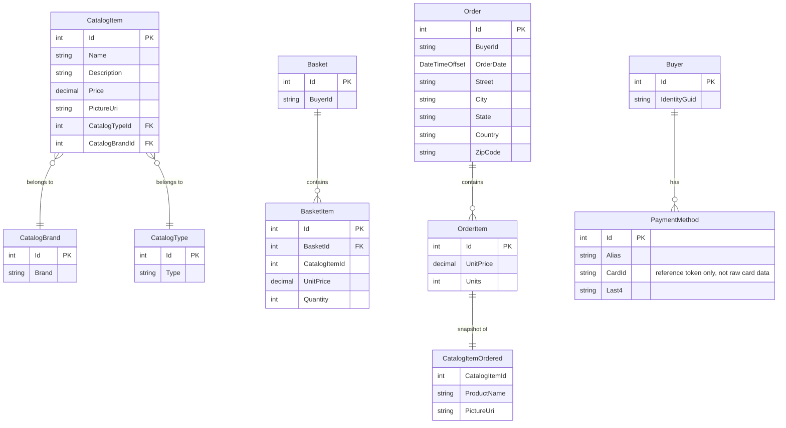

# Data Architecture & Persistence Layer

eShopOnWeb uses two EF Core 8 DbContexts backed by SQL Server (with an In-Memory EF provider for development/testing), managing 9 domain entities across catalog, basket, order, and buyer aggregates.

## Database Configuration

| Service / Module | DB Type | Profile | Driver | Connection | Migration Tool |
|---|---|---|---|---|---|
| Infrastructure (CatalogContext) | SQL Server | Development / Docker | Microsoft.EntityFrameworkCore.SqlServer 8.0.2 | LocalDB / Docker `(localdb)\mssqllocaldb`; Production from Azure Key Vault | EF Core Migrations (`Data/Migrations/`) |
| Infrastructure (AppIdentityDbContext) | SQL Server | Development / Docker | Microsoft.EntityFrameworkCore.SqlServer 8.0.2 | LocalDB / Docker `(localdb)\mssqllocaldb`; Production from Azure Key Vault | EF Core Migrations (`Identity/Migrations/`) |
| Infrastructure (CatalogContext) | In-Memory | Test / local dev | Microsoft.EntityFrameworkCore.InMemory 8.0.2 | N/A — purely in-process | N/A (schema managed programmatically) |
| Infrastructure (AppIdentityDbContext) | In-Memory | Test / local dev | Microsoft.EntityFrameworkCore.InMemory 8.0.2 | N/A | N/A |

In production, `EnableRetryOnFailure()` is applied to both SQL Server contexts for transient fault handling. Seed data is applied programmatically at startup via `CatalogContextSeed` and `AppIdentityDbContextSeed`. No Flyway or Liquibase equivalents are used — schema changes are managed exclusively through EF Core code-first migrations.

## Data Ownership per Service

| Service | Tables / Entities Owned | ORM Framework | Caching | Notes |
|---|---|---|---|---|
| Infrastructure / CatalogContext | CatalogItems, CatalogBrands, CatalogTypes, Baskets, BasketItems, Orders, OrderItems | EF Core 8 (generic `EfRepository<T>`) | None at DB layer; Web service wraps reads in `IMemoryCache` | Single shared `CatalogContext` for catalog + basket + order data |
| Infrastructure / AppIdentityDbContext | AspNetUsers, AspNetRoles, AspNetUserRoles, AspNetUserClaims, etc. | EF Core 8 + ASP.NET Core Identity | None | Standard Identity schema; no custom tables added |
| Web / CachedCatalogViewModelService | Reads from CatalogContext (no ownership) | EF Core (via IRepository) | ASP.NET Core `IMemoryCache` (sliding 30 s) | Cache-aside decorator over `CatalogViewModelService` |
| BlazorAdmin / CachedCatalogItemServiceDecorator | Reads from PublicApi REST (no DB ownership) | Via HTTP to PublicApi | `ILocalStorage` (Blazored.LocalStorage) | Client-side cache in browser local storage |

## Entity Model

## Key Repository Methods

| Service | Repository / Query Service | Notable Custom Methods | Purpose |
|---|---|---|---|
| Infrastructure | `EfRepository<T>` (via `RepositoryBase<T>` from Ardalis.Specification.EFCore) | `ListAsync(spec)`, `CountAsync(spec)`, `FirstOrDefaultAsync(spec)`, `AddAsync`, `UpdateAsync`, `DeleteAsync` | Specification-based generic CRUD for all `IAggregateRoot` entities |
| Infrastructure | `BasketQueryService` | `CountTotalBasketItems(string username)` | EF Core LINQ sum of basket item quantities by buyer ID; avoids loading all items into memory |
| ApplicationCore | `IRepository<T>` / `IReadRepository<T>` | Defined in `ApplicationCore.Interfaces` | Dependency inversion interfaces consumed by domain services; implemented by `EfRepository<T>` |

## Caching Strategy

| Layer | Provider | Pattern | TTL / Eviction | Cached Data | Rationale |
|---|---|---|---|---|---|
| Web Service | ASP.NET Core `IMemoryCache` (in-process) | Cache-aside decorator (`CachedCatalogViewModelService`) | Sliding expiration: **30 seconds** | Catalog brands list, catalog types list, paged catalog item view models | Catalog reference data changes infrequently; 30 s sliding window balances freshness with DB load reduction |
| Blazor Admin SPA | `Blazored.LocalStorage` (browser local storage) | Cache-aside decorator (`CachedCatalogItemServiceDecorator`) | Browser session / page lifetime | Catalog brands and types lookup data | Avoids repeated API round-trips from the SPA for stable reference data |
| PublicApi | None | — | — | — | No server-side caching on the REST API layer |

There is no distributed cache (Redis, SQL distributed cache, etc.). The in-process `IMemoryCache` is not shared across multiple Web service instances, which means cache state is not replicated in scaled-out deployments.

## Data Ownership Boundaries

Both `CatalogContext` and `AppIdentityDbContext` are backed by **separate SQL Server databases** (separate connection strings: `CatalogConnection` and `IdentityConnection`), providing logical isolation between business and identity data. There is no cross-context join or direct table sharing.

Cross-service data access is exclusively via **in-process service calls** within the same deployable unit — the `Web` service and `PublicApi` service each embed both `CatalogContext` and `AppIdentityDbContext` and resolve them through DI. There is no inter-service REST call for data access; the Blazor Admin SPA is the only component that accesses data remotely (via `PublicApi` HTTP endpoints).

The `BasketQueryService` uses an EF Core LINQ sum query (`SumAsync`) directly against `CatalogContext`, which is the only service that issues a custom aggregate query rather than using the generic specification-based repository.

### Data Classification & Sensitivity

| Entity | Sensitive Fields | Classification | Controls in Place |
|---|---|---|---|
| Order | Street, City, State, Country, ZipCode (ship-to address) | PII | No encryption-at-rest or field-level masking configured; protected by SQL Server access controls only |
| Order | BuyerId (maps to username / email) | PII | No masking; stored as plain string |
| Buyer | IdentityGuid (maps to ASP.NET Identity user ID) | PII | No masking; stored as plain string |
| PaymentMethod | CardId, Last4 | PCI-adjacent | `CardId` is documented in code as a reference token only ("actual card data must be stored in a PCI compliant system, like Stripe") — raw card numbers are not stored; no additional masking on `Last4` |
| Basket | BuyerId (username) | PII | No masking |
| AspNetUsers (Identity) | Email, UserName, PasswordHash, SecurityStamp | PII | Password stored as bcrypt hash via ASP.NET Core Identity; email/username stored in plain text; no column-level encryption |

**Summary**: The application stores PII in Order, Buyer, Basket, and Identity entities. No encryption-at-rest, column-level masking, or data anonymization is configured. Protection relies on SQL Server-level access controls and application-layer authentication. Payment data is intentionally limited to a reference token, avoiding PCI scope for raw card data.
