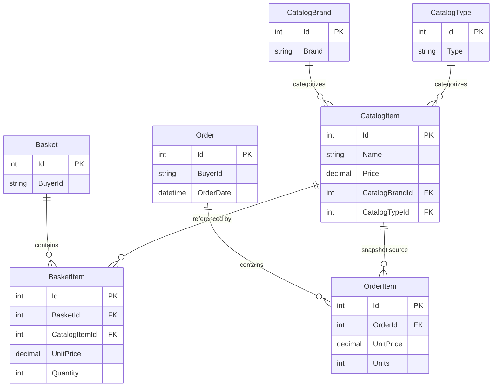

# Data Architecture & Persistence Layer

The data layer is centered on EF Core with SQL Server persistence for catalog/order and identity concerns, plus optional in-memory providers for local and test execution.

## Database Configuration

| Service/Module | DB Type | Profile | Driver | Connection | Migration Tool |
|---|---|---|---|---|---|
| Infrastructure (CatalogContext) | SQL Server | Development/Docker/Production | `Microsoft.EntityFrameworkCore.SqlServer` | Connection string from `CatalogConnection` or KeyVault-backed value | EF Core Migrations |
| Infrastructure (AppIdentityDbContext) | SQL Server | Development/Docker/Production | `Microsoft.EntityFrameworkCore.SqlServer` | Connection string from `IdentityConnection` or KeyVault-backed value | EF Core Migrations |
| Infrastructure (CatalogContext) | InMemory | `UseOnlyInMemoryDatabase=true` | `Microsoft.EntityFrameworkCore.InMemory` | Named in-memory store `Catalog` | None |
| Infrastructure (AppIdentityDbContext) | InMemory | `UseOnlyInMemoryDatabase=true` | `Microsoft.EntityFrameworkCore.InMemory` | Named in-memory store `Identity` | None |

## Data Ownership per Service

| Service | Tables Owned | ORM Framework | Caching | Notes |
|---|---|---|---|---|
| Web / PublicApi domain | CatalogItems, CatalogBrands, CatalogTypes, Baskets, BasketItems, Orders, OrderItems | EF Core | IMemoryCache for selected read paths | Shared schema through `CatalogContext` |
| Identity | ASP.NET Identity tables | EF Core Identity | None | Stored via `AppIdentityDbContext` |
| BlazorAdmin client | Browser local cache entries | N/A (client-side) | Blazored.LocalStorage | Caches API response DTOs |

## Entity Model

## Key Repository Methods

| Service | Repository | Notable Methods | Purpose |
|---|---|---|---|
| BasketService | `IRepository<Basket>` | `FirstOrDefaultAsync(BasketWithItemsSpecification)`, `UpdateAsync`, `DeleteAsync` | Load basket with items and persist quantity/transfer/delete operations |
| OrderService | `IRepository<CatalogItem>`, `IRepository<Order>` | `ListAsync(CatalogItemsSpecification)`, `AddAsync(Order)` | Resolve current item metadata and create order snapshot |
| Catalog API endpoints | `IRepository<CatalogItem>` | `CountAsync`, `ListAsync(CatalogFilterSpecification)`, `GetByIdAsync` | Paginated catalog retrieval and CRUD |
| Order query handlers | `IReadRepository<Order>` | `ListAsync(MyOrdersSpecification)`, `FirstOrDefaultAsync(OrderWithItemsByIdSpec)` | Fetch order history/details for authenticated user |

## Caching Strategy

Server-side caching uses `IMemoryCache` for catalog list/lookup data and identity revocation markers with short sliding windows. Blazor admin adds client-side local storage caching for catalog lookup and list responses. The pattern is cache-aside in both cases, with refresh/recompute on miss.

## Data Ownership Boundaries

The application uses a shared data-store model for core business modules through a single catalog context, while identity data is isolated in a separate identity context. Cross-service data exchange is mostly in-process via shared libraries rather than network-based data ownership boundaries. Read and write paths both go through repository abstractions; no CQRS/event-store split was detected.

### Data Classification & Sensitivity

| Entity | Sensitive Fields | Classification (PII/PHI/PCI/None) | Controls in Place |
|---|---|---|---|
| Order (ShipToAddress value object) | Name, street, city, state, zip, country | PII | Relies on application auth and database controls; no field-level masking in code |
| Basket | BuyerId | PII | User-scoped access through authenticated context |
| Identity user tables | Username/email/claims | PII | ASP.NET Identity framework protections |
| Catalog entities | Product metadata/pricing | None | Standard application access controls |
