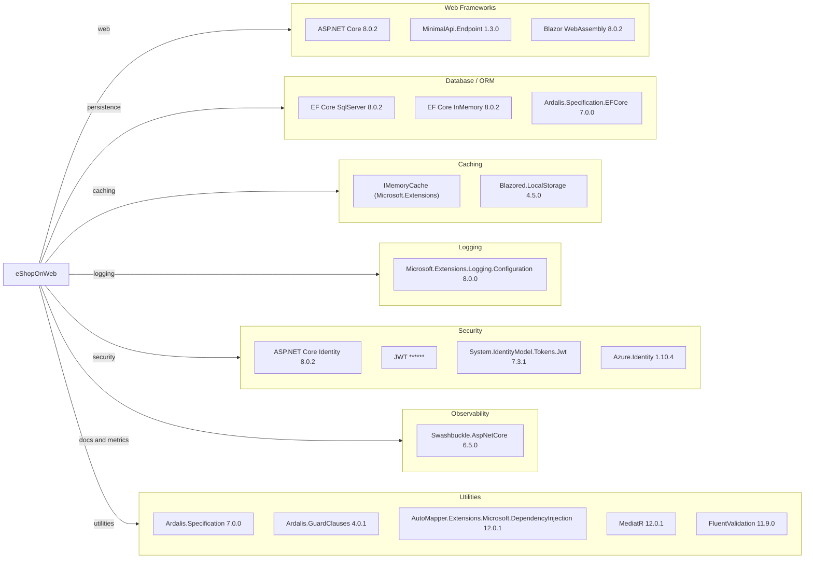

# Dependency Map

This .NET solution declares centralized package versions in `Directory.Packages.props`, with production dependencies concentrated around ASP.NET Core, EF Core, identity/security, and supporting libraries.

## Dependencies

### Dependency Summary

| Category | Count | Key Libraries | Notes |
|---|---:|---|---|
| Web Frameworks | 3 | ASP.NET Core, MinimalApi.Endpoint, Blazor | Primary HTTP and UI stack |
| Database / ORM | 3 | EF Core SqlServer/InMemory, Ardalis.Specification.EFCore | SQL Server with in-memory fallback for dev/test |
| Caching | 2 | IMemoryCache, Blazored.LocalStorage | Server memory cache and browser local storage caching |
| Logging | 1 | Microsoft.Extensions.Logging.Configuration | Built-in logging stack |
| Security | 4 | Identity, JwtBearer, Jwt tokens, Azure.Identity | AuthN/AuthZ and cloud identity integration |
| Observability | 1 | Swashbuckle | Swagger/OpenAPI documentation |
| Utilities | 5 | Ardalis, AutoMapper, MediatR, FluentValidation | Core patterns and helper libraries |

### Version & Compatibility Risks

Most core runtime packages target .NET 8 and are current for the baseline in this repo. Potential modernization risks include older utility packages (`Ardalis.ListStartupServices`, `BuildBundlerMinifier`, `Microsoft.AspNetCore.Mvc` 2.2.0 reference) that may require replacement or removal in future major upgrades.

### Notable Observations

- Package versions are centrally managed through `Directory.Packages.props`, simplifying coordinated upgrades.
- Solution mixes MVC/Razor pages, minimal APIs, and Blazor with shared domain libraries.
- EF Core InMemory is used across runtime and tests; behavior differences from SQL Server should be considered.
- Swagger and JWT packages indicate externally consumable API surfaces requiring continued security review.

## Test Dependencies

| Framework | Version | Notes |
|---|---|---|
| xUnit | 2.7.0 | Unit/integration test framework |
| xUnit runner visualstudio | 2.5.6 | Test runner adapter |
| xUnit runner console | 2.7.0 | Console test execution |
| MSTest.TestFramework | 3.2.2 | Used in Public API integration tests |
| MSTest.TestAdapter | 3.2.2 | MSTest runner adapter |
| Microsoft.NET.Test.Sdk | 17.9.0 | Test project SDK |
| NSubstitute | 5.1.0 | Mocking framework |
| coverlet.collector | 6.0.2 | Coverage collection |

Total test-scope dependencies: 8

The project has robust test framework coverage across xUnit and MSTest, with mocking and coverage tooling in place.
