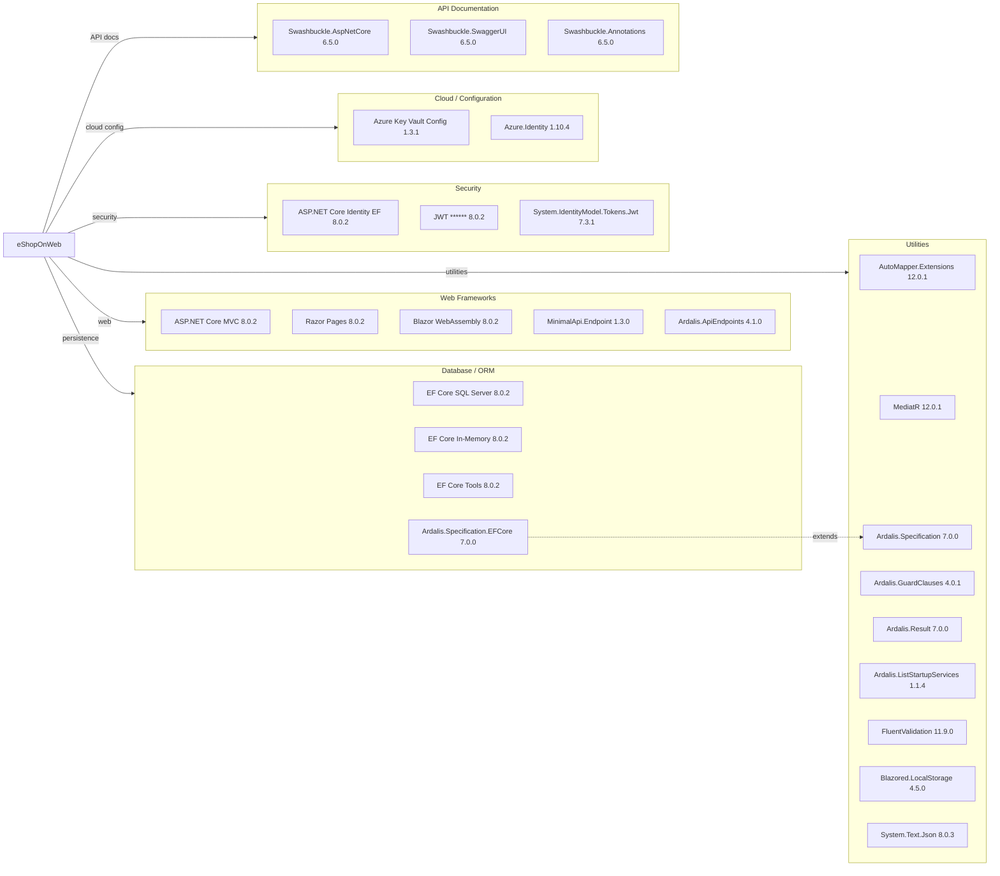

# Dependency Map

eShopOnWeb is an ASP.NET Core 8 (.NET 8) multi-project solution with 28 declared production dependencies managed centrally via `Directory.Packages.props`.

## Dependencies

### Dependency Summary

| Category | Count | Key Libraries | Notes |
|---|---|---|---|
| Web Frameworks | 5 | ASP.NET Core MVC 8.0.2, Blazor WebAssembly 8.0.2, Ardalis.ApiEndpoints 4.1.0 | Modern stack on .NET 8; Blazor WASM used for admin SPA |
| Database / ORM | 4 | EF Core 8.0.2 (SQL Server + In-Memory), Ardalis.Specification.EFCore 7.0.0 | EF Core 8 is current; In-Memory provider used for dev/test |
| Security | 3 | ASP.NET Core Identity 8.0.2, JWT ****** System.IdentityModel.Tokens.Jwt 7.3.1 | All current versions |
| Cloud / Configuration | 2 | Azure Key Vault Config 1.3.1, Azure.Identity 1.10.4 | Azure.Identity 1.10.4 has newer releases available |
| API Documentation | 3 | Swashbuckle.AspNetCore 6.5.0 | Swashbuckle 6.5 is behind latest (7.x); consider upgrade |
| Utilities | 9 | AutoMapper 12.0.1, MediatR 12.0.1, FluentValidation 11.9.0, Ardalis.* | Well-maintained libraries; versions are reasonably current |

### Version & Compatibility Risks

The core .NET 8 and ASP.NET Core 8 dependencies are on a supported LTS release. **Swashbuckle.AspNetCore 6.5.0** is behind the current 7.x release line and lacks .NET 9 support improvements; it should be updated if the project is upgraded to .NET 9 or later. **Azure.Identity 1.10.4** has several patch releases available above it (latest ~1.12.x) that address managed-identity reliability fixes. **System.IdentityModel.Tokens.Jwt 7.3.1** is from the Microsoft.IdentityModel family — version 8.x is available with performance improvements, though the 7.x line remains supported. No end-of-life or abandoned packages were detected.

### Notable Observations

- **Dual specification pattern**: Both `Ardalis.Specification` (base) and `Ardalis.Specification.EntityFrameworkCore` are referenced separately across projects, which is intentional — `ApplicationCore` takes only the base abstraction while `Infrastructure` takes the EF Core implementation.
- **MediatR + Ardalis.ApiEndpoints dual-pattern**: The `Web` project uses MediatR for CQRS-style dispatch while `PublicApi` uses `Ardalis.ApiEndpoints` and `MinimalApi.Endpoint` — two different request-handling paradigms coexist in the solution.
- **In-Memory EF provider in production projects**: `Microsoft.EntityFrameworkCore.InMemory` is declared in both `Web` and `Infrastructure` production projects (not just test projects), enabling easy dev/CI mode without SQL Server but introducing a risk of accidentally running in-memory in production.
- **No caching or messaging libraries**: The application has no Redis, MemoryCache, or message-broker dependencies declared; all state is persisted directly to SQL Server with no distributed caching layer.

## Test Dependencies

| Framework | Version | Notes |
|---|---|---|
| xunit | 2.7.0 | Primary unit and integration test framework |
| xunit.runner.visualstudio | 2.5.6 | VS Test Explorer runner |
| xunit.runner.console | 2.7.0 | CLI runner |
| Microsoft.NET.Test.Sdk | 17.9.0 | .NET test host |
| Microsoft.AspNetCore.Mvc.Testing | 8.0.2 | In-process integration test server |
| MSTest.TestAdapter | 3.2.2 | MSTest adapter (secondary, likely for specific test projects) |
| MSTest.TestFramework | 3.2.2 | MSTest framework |
| NSubstitute | 5.1.0 | Mocking library |
| NSubstitute.Analyzers.CSharp | 1.0.17 | Roslyn analyzer for NSubstitute usage |
| coverlet.collector | 6.0.2 | Code coverage collection |

Total test-scope dependencies: 10

Both xUnit and MSTest frameworks are declared centrally, suggesting different test projects may use different frameworks. `Microsoft.AspNetCore.Mvc.Testing` enables full integration tests against the real HTTP pipeline, which is a strong testing practice. No contract-testing (e.g., PactNet) or load-testing library is present.
