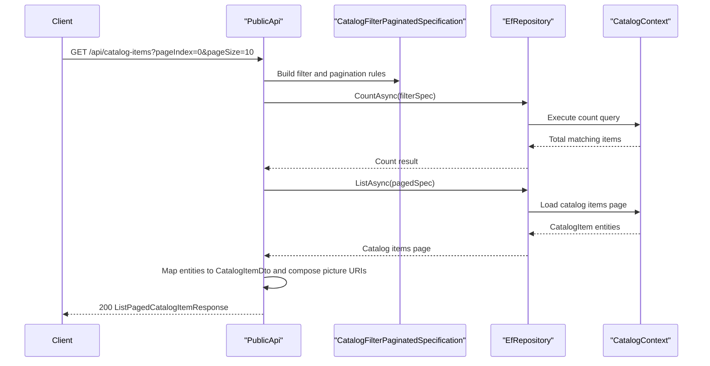

# API & Service Communication Contracts

The repository exposes a focused set of REST endpoints through `PublicApi` and a larger authenticated browser workflow through the `Web` project. Communication is synchronous HTTP plus in-process service calls; there are no message brokers, service discovery components, or distributed gateway hops in this codebase.

## Service Catalog

| Service | Port | Category | Purpose |
|---|---:|---|---|
| `Web` | 5001 dev, 5106 docker | Business | Customer storefront, account flows, checkout, embedded Blazor host |
| `PublicApi` | 5099 dev, 5200 docker | API Layer | Catalog read endpoints, catalog admin writes, authentication token issuance |
| `BlazorAdmin` | Hosted by `Web` | API Layer | Browser admin client that consumes `PublicApi` |
| `SQL Server` | 1433 | Infrastructure | Stores catalog, basket, order, and identity data |
| `Azure Key Vault` | N/A | Infrastructure | Production secret source for connection-string indirection |

## API Endpoints Inventory

| Service | Method | Path | Request Type | Response Type |
|---|---|---|---|---|
| `PublicApi` | POST | `/api/authenticate` | `AuthenticateRequest` body | `AuthenticateResponse` with JWT and sign-in flags |
| `PublicApi` | GET | `/api/catalog-items` | Query params `pageSize`, `pageIndex`, `catalogBrandId`, `catalogTypeId` | `ListPagedCatalogItemResponse` |
| `PublicApi` | GET | `/api/catalog-items/{catalogItemId}` | Path param `catalogItemId` | `GetByIdCatalogItemResponse` |
| `PublicApi` | POST | `/api/catalog-items` | `CreateCatalogItemRequest` body | `CreateCatalogItemResponse` |
| `PublicApi` | PUT | `/api/catalog-items` | `UpdateCatalogItemRequest` body | `UpdateCatalogItemResponse` |
| `PublicApi` | DELETE | `/api/catalog-items/{catalogItemId}` | Path param `catalogItemId` | `DeleteCatalogItemResponse` |
| `PublicApi` | GET | `/api/catalog-brands` | None | `ListCatalogBrandsResponse` |
| `PublicApi` | GET | `/api/catalog-types` | None | `ListCatalogTypesResponse` |
| `Web` | GET | `/Order/MyOrders` | Authenticated browser request | MVC view of `OrderViewModel` items |
| `Web` | GET | `/Order/Detail/{orderId}` | Path param `orderId` | MVC detail view or `BadRequest` |
| `Web` | GET and POST | `/Manage/*` | Browser form fields and identity tokens | MVC account-management views and redirects |
| `Web` | GET and POST | `/User/*` | Browser form fields | Login, logout, and user-account responses |

## Management & Observability Endpoints

| Service | Endpoint | Custom Metrics (if any) |
|---|---|---|
| `PublicApi` | `/swagger` | None detected |
| `PublicApi` | `/swagger/v1/swagger.json` | None detected |
| `Web` | `/health` | None detected |
| `Web` | `home_page_health_check` | Custom health-check tag `homePageHealthCheck` |
| `Web` | `api_health_check` | Custom health-check tag `apiHealthCheck` |
| `Web` | `/allservices` in development | Service-registration diagnostic list |

## DTOs & Contracts

The public contracts are request and response message classes under `src/PublicApi`, each carrying a correlation identifier through the shared `BaseRequest`, `BaseResponse`, and `BaseMessage` model. Catalog contracts are service-level DTOs such as `CatalogItemDto`, `CatalogBrandDto`, and `CatalogTypeDto`, while authentication uses `AuthenticateRequest` and `AuthenticateResponse` to exchange credentials and bearer tokens.

Immutability is used selectively rather than universally. Most API DTOs are mutable classes for model binding, while domain-side `CatalogItem.CatalogItemDetails` is represented as a C# `record struct`, making it an immutable detail carrier for catalog updates. Serialization is handled by the default ASP.NET Core JSON stack, and Swagger metadata is generated through Swashbuckle annotations and endpoint metadata.

## Communication Patterns

All inter-component communication is synchronous. Browser clients call the `Web` site for storefront and account workflows, while the Blazor admin UI calls `PublicApi` over HTTP. Inside the process boundary, MVC controllers, Razor Pages, and minimal endpoints delegate to domain services, MediatR handlers, or repository abstractions.

There is no asynchronous messaging, event bus, or service discovery layer. Startup ordering matters only in the sense that the web and API applications both require SQL Server availability before their seed routines succeed. Security is split between cookie authentication for the `Web` project and JWT bearer authentication for privileged catalog changes in `PublicApi`. Mutation endpoints require the administrator role, CORS is restricted to the configured web origin, and HTTPS redirection is enabled; however, JWT validation does not enforce issuer or audience checks.

## Service Technology Matrix

| Service | Web | Data Access | Discovery | Gateway | Actuator | Cache | Metrics |
|---|---|---|---|---|---|---|---|
| `Web` | MVC, Razor Pages, server-side Blazor host | EF Core via repository and MediatR handlers | None | None | Health checks | In-process memory cache | Custom health checks only |
| `PublicApi` | Minimal endpoints and controller endpoint for auth | EF Core via repository | None | None | Swagger docs | In-process memory cache registered | None detected |
| `BlazorAdmin` | Blazor WebAssembly client | HTTP calls to `PublicApi` | None | None | None | Browser local storage | None detected |

## Service Communication Sequence

