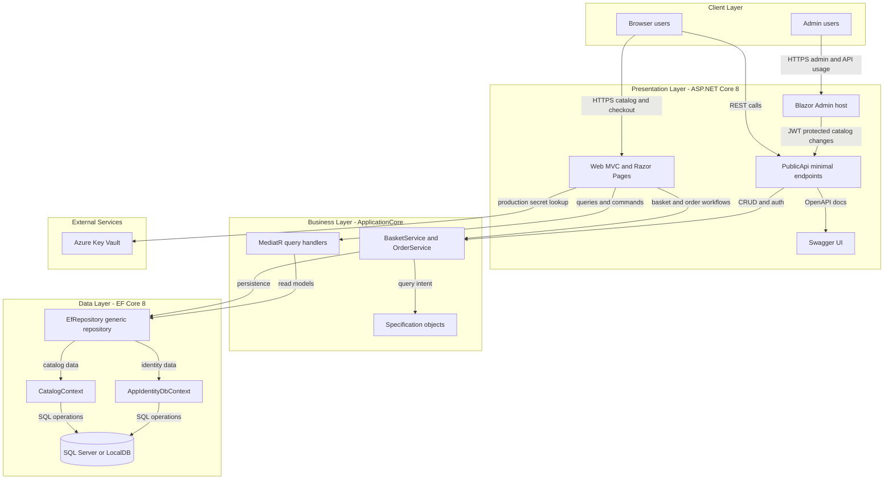
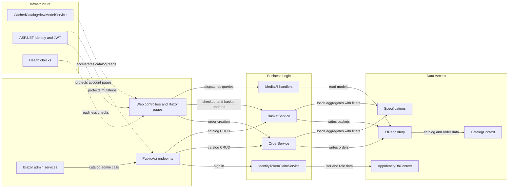

# Architecture Diagram

This repository implements an e-commerce reference application with separate web, API, domain, infrastructure, and Blazor admin projects. The runtime is centered on ASP.NET Core 8, EF Core 8, and SQL Server with optional Azure Key Vault integration for production secrets.

## Application Architecture

### Technology Stack Summary

| Layer | Technology | Version | Purpose |
|---|---|---:|---|
| Client | Browser UI and Blazor admin | N/A | Customer storefront and administrator experience |
| Presentation | ASP.NET Core MVC, Razor Pages, MinimalApi.Endpoint | .NET 8 / ASP.NET Core 8.0.2 | Web UI, server-rendered pages, REST API endpoints |
| Business | ApplicationCore, MediatR, Ardalis.Specification | MediatR 12.0.1, Specification 7.0.0 | Domain workflows, query orchestration, reusable business rules |
| Data | EF Core, ASP.NET Identity | 8.0.2 | Data access, identity persistence, object-relational mapping |
| Integration | Azure Key Vault, Swagger | Azure.Identity 1.10.4, Swashbuckle 6.5.0 | Secret resolution in production and API documentation |

### Data Storage & External Services

The application persists business data and identity data in SQL Server through two EF Core contexts: `CatalogContext` for catalog, basket, and orders; and `AppIdentityDbContext` for ASP.NET Identity. Local development uses LocalDB or Docker-hosted Azure SQL Edge, while production configuration can pull connection-string indirection from Azure Key Vault.

### Key Architectural Decisions

- Uses a clean layered split between `ApplicationCore`, `Infrastructure`, and presentation projects so domain workflows remain independent from UI concerns.
- Encapsulates persistence behind `EfRepository<T>` and Ardalis specification objects instead of exposing EF Core directly to controllers and endpoints.
- Keeps the admin experience and public HTTP API separate from the storefront while sharing the same domain model and databases.

## Component Relationships

### Component Inventory

| Component | Layer | Type | Responsibility |
|---|---|---|---|
| `Web` | Presentation | MVC app and Razor Pages host | Serves storefront pages, account features, checkout, and embedded Blazor assets |
| `PublicApi` | Presentation | Minimal API and controller host | Exposes authentication plus catalog read and admin write endpoints |
| `BlazorAdmin` | Presentation | Blazor WebAssembly client | Provides the admin user interface that calls the API |
| `BasketService` | Business Logic | Domain service | Creates baskets, updates quantities, transfers baskets on sign-in |
| `OrderService` | Business Logic | Domain service | Converts basket contents into persisted orders |
| `GetMyOrders` and `GetOrderDetails` handlers | Business Logic | MediatR handlers | Builds storefront order read models for authenticated users |
| `EfRepository<T>` | Data Access | Generic repository | Executes CRUD and specification-based queries over EF Core |
| `CatalogContext` | Data Access | DbContext | Owns catalog, basket, and order persistence |
| `AppIdentityDbContext` | Data Access | Identity DbContext | Owns application users, roles, and authentication data |
| `CachedCatalogViewModelService` | Infrastructure | Cache wrapper | Caches catalog, brand, and type lookups in process memory |
