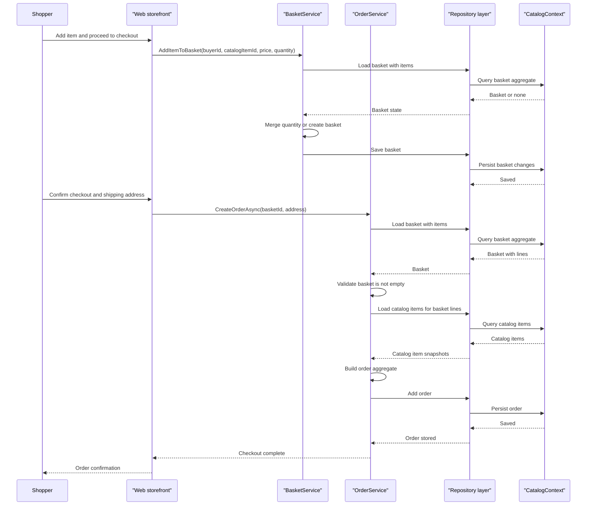

# Core Business Workflows

The application supports a typical online storefront domain: customers browse catalog items, manage baskets, and place orders, while administrators maintain catalog data through a dedicated admin client and API. Most business behavior is concentrated in basket and order services plus a set of read-oriented MediatR handlers.

## Domain Entities

| Entity | Service / Bounded Context | Description | Key Relationships |
|---|---|---|---|
| `CatalogItem` | Catalog | Sellable product with brand, type, price, description, and picture URI | Belongs to one `CatalogBrand` and one `CatalogType` |
| `CatalogBrand` | Catalog | Business brand classification for products | Groups many catalog items |
| `CatalogType` | Catalog | Product type classification | Groups many catalog items |
| `Basket` | Shopping | Customer shopping basket | Contains many `BasketItem` rows and references a buyer identifier |
| `BasketItem` | Shopping | Line item within a basket | References a catalog item identifier |
| `Order` | Ordering | Finalized purchase built from basket contents | Contains many `OrderItem` rows and owns an address value object |
| `OrderItem` | Ordering | Snapshot of purchased catalog data, price, and quantity | Belongs to one order |
| `Address` | Ordering | Shipping destination captured at checkout | Owned by one order |
| ASP.NET Identity user | Identity | Authenticated shopper or administrator account | Linked to roles and used to secure flows |

## Service-to-Domain Mapping

| Service | Domain Context | Owned Entities | External Dependencies |
|---|---|---|---|
| `BasketService` | Shopping basket management | `Basket`, `BasketItem` | `IRepository<Basket>`, application logger |
| `OrderService` | Checkout and order creation | `Order`, `OrderItem`, `Address` | `IRepository<Order>`, `IRepository<Basket>`, `IRepository<CatalogItem>`, URI composer |
| Web order query handlers | Order history | Read models over `Order` | MediatR, `IReadRepository<Order>` |
| `PublicApi` catalog endpoints | Catalog administration and browsing | `CatalogItem`, `CatalogBrand`, `CatalogType` | Generic repositories, AutoMapper, JWT auth |
| ASP.NET Identity services | Identity and access | Users, roles, token claims | SignInManager, UserManager, RoleManager |

## Primary Workflows

### Workflow 1: Browse catalog and filter products

The storefront or admin client requests paged catalog data, optionally filtered by brand and type. The API builds specification objects for filtering and pagination, counts matching records, loads the requested page, maps the entities into DTOs, and normalizes picture URIs before returning the response.

### Workflow 2: Add items to a basket

A signed-in or anonymous shopper adds a catalog item to a basket through the web experience. `BasketService` loads the current basket with `BasketWithItemsSpecification`, creates a new basket when necessary, merges quantities when the item already exists, and persists the updated aggregate through the repository.

### Workflow 3: Checkout and create an order

During checkout, `OrderService` loads the basket with items, enforces the `EmptyBasketOnCheckout` guard rule, batch-loads the referenced catalog items, converts basket lines into order item snapshots, constructs the `Order` aggregate with its shipping address, and saves it as the source-of-truth purchase record.

### Workflow 4: Admin catalog maintenance

An administrator authenticates through `/api/authenticate`, receives a JWT, and then uses the Blazor admin UI to create, update, or delete catalog items through the protected catalog endpoints. Role-based authorization gates all write operations.

## Cross-Service Data Flows

There is no multi-service network choreography inside this repository. Instead, the `Web` project, `PublicApi`, and the Blazor admin client share the same domain model and databases. The most important composition flow is checkout, where the order workflow joins basket state with current catalog item details to produce immutable order item snapshots. The admin flow is another cross-project path: the Blazor client calls `PublicApi`, which then updates shared persistence used later by the storefront.

## Business Workflow Sequence

## Business Rules & Decision Logic

- Basket updates merge quantities by `CatalogItemId` instead of duplicating lines, and zero-quantity lines are removed from the basket.
- Checkout is blocked when the basket is empty through the custom `EmptyBasketOnCheckout` guard rule.
- Catalog updates require valid names, descriptions, and positive prices through domain guard clauses before mutations are accepted.
- Order creation snapshots catalog item information at purchase time so later catalog changes do not rewrite historical orders.
- Administrative catalog writes require the administrator role and JWT bearer authentication, while account and order-history views rely on the authenticated web user context.
