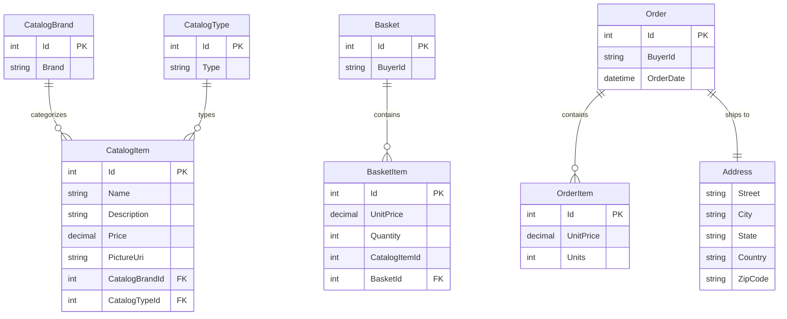

# Data Architecture & Persistence Layer

The data layer is built on EF Core 8 with one business DbContext and one identity DbContext backed by SQL Server. Core persisted aggregates cover catalog, basket, and order workflows, with optional in-memory databases for test-oriented or lightweight execution paths.

## Database Configuration

| Service/Module | DB Type | Profile | Driver | Connection | Migration Tool |
|---|---|---|---|---|---|
| `Infrastructure` / `CatalogContext` | SQL Server or LocalDB | Default and Development | EF Core SqlServer 8.0.2 | `CatalogConnection` from `appsettings*.json` | EF Core migrations and seed routines |
| `Infrastructure` / `AppIdentityDbContext` | SQL Server or LocalDB | Default and Development | Identity EF Core 8.0.2 | `IdentityConnection` from `appsettings*.json` | EF Core migrations and seed routines |
| `Web` production path | Azure SQL | Production | EF Core SqlServer 8.0.2 | Connection string resolved indirectly via Azure Key Vault | EF Core migrations with retry-enabled connections |
| `Web` and tests optional path | In-memory database | Test or `UseOnlyInMemoryDatabase=true` | EF Core InMemory 8.0.2 | No external connection string | No schema migration; ephemeral runtime store |

## Data Ownership per Service

| Service | Tables Owned | ORM Framework | Caching | Notes |
|---|---|---|---|---|
| `CatalogContext` | `Catalog`, `CatalogBrands`, `CatalogTypes`, `Baskets`, `BasketItems`, `Orders`, `OrderItems` | EF Core 8 | None at persistence layer | Single context for catalog, basket, and order aggregates |
| `AppIdentityDbContext` | ASP.NET Identity tables | ASP.NET Core Identity on EF Core 8 | None | Separate context isolates user and role management |
| `Web` | None directly; reads and writes through repositories | EF Core via repository abstractions | IMemoryCache in view-model layer | Cache is applied above persistence, not inside DbContext |
| `PublicApi` | None directly; uses shared contexts through repositories | EF Core via repository abstractions | IMemoryCache registered | Uses the same shared data store as `Web` |

## Entity Model

## Key Repository Methods

| Service | Repository | Notable Methods | Purpose |
|---|---|---|---|
| `BasketService` | `IRepository<Basket>` via `EfRepository<Basket>` | `FirstOrDefaultAsync(BasketWithItemsSpecification)`, `AddAsync`, `UpdateAsync`, `DeleteAsync` | Load a buyer basket with items, create missing baskets, update quantities, and remove anonymous baskets |
| `OrderService` | `IRepository<Order>` via `EfRepository<Order>` | `AddAsync(order)` | Persist a new order assembled from basket contents |
| `OrderService` | `IRepository<CatalogItem>` via `EfRepository<CatalogItem>` | `ListAsync(CatalogItemsSpecification)` | Batch-load catalog items for order item snapshots |
| `Catalog endpoints` | `IRepository<CatalogItem>` via `EfRepository<CatalogItem>` | `CountAsync(filterSpec)`, `ListAsync(pagedSpec)`, `GetByIdAsync`, `UpdateAsync` | Support filtered catalog browsing and admin catalog maintenance |
| `Order query handlers` | `IReadRepository<Order>` via `EfRepository<Order>` | `ListAsync(CustomerOrdersSpecification)` | Build read models for authenticated customer order history |

## Caching Strategy

| Layer | Provider | Pattern | Scope | Rationale |
|---|---|---|---|---|
| `Web` catalog view models | `IMemoryCache` | Cache-aside with sliding expiration | Single process | Reduces repeated catalog, brand, and type queries for storefront browsing |
| `PublicApi` registration | `IMemoryCache` | Registered but no dedicated cache wrapper identified | Single process | Leaves room for endpoint-level caching without introducing distributed infrastructure |

No distributed cache, second-level ORM cache, or cache invalidation bus is configured in the repository. Cache behavior is intentionally simple and bound to a single application instance.

## Data Ownership Boundaries

The repository uses a shared relational data store with logical separation rather than a database-per-service topology. `CatalogContext` owns business data and `AppIdentityDbContext` owns identity data, but both contexts point at sibling SQL Server databases defined by the same application configuration model.

Cross-component data access happens through shared repository abstractions inside the same deployment unit; there are no cross-service REST or event-based persistence calls. Query specialization is enabled through specification classes such as `BasketWithItemsSpecification`, `CustomerOrdersSpecification`, and `CatalogItemsSpecification`, which provide the read-side shapes needed by checkout and order-history workflows.

### Data Classification & Sensitivity

| Entity | Sensitive Fields | Classification (PII/PHI/PCI/None) | Controls in Place |
|---|---|---|---|
| `Order` | `BuyerId`, owned `Address` fields | PII | No field-level masking or encryption is configured in code; relies on database and hosting controls |
| `Basket` | `BuyerId` | PII | No explicit masking or encryption in code |
| ASP.NET Identity user | Username, email, password hash | PII | Passwords are hashed by ASP.NET Identity; no additional masking or encryption configuration is present in code |
| `CatalogItem`, `CatalogBrand`, `CatalogType` | None | None | Public catalog data |

