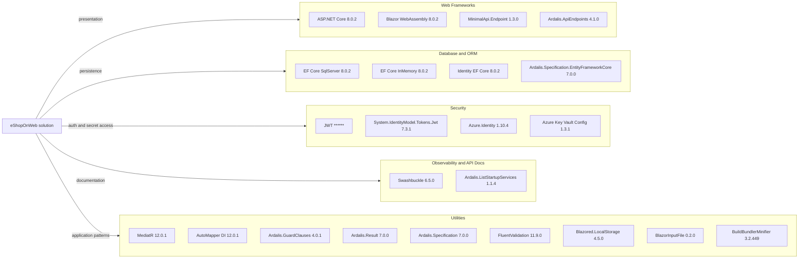

# Dependency Map

This .NET 8 solution centrally manages package versions through `Directory.Packages.props` and declares roughly 30 top-level NuGet packages, including platform, domain-pattern, Azure, API, and test dependencies.

## Dependencies

### Dependency Summary

| Category | Count | Key Libraries | Notes |
|---|---:|---|---|
| Web Frameworks | 4 | ASP.NET Core, Blazor WebAssembly, MinimalApi.Endpoint, Ardalis.ApiEndpoints | Supports MVC storefront, Blazor admin, and minimal REST endpoints |
| Database / ORM | 4 | EF Core SqlServer, EF Core InMemory, Identity EF Core, Ardalis.Specification.EntityFrameworkCore | SQL Server persistence plus in-memory testing path |
| Security | 4 | JWT Bearer, System.IdentityModel.Tokens.Jwt, Azure.Identity, Azure Key Vault config | Handles auth tokens and production secret access |
| Observability | 2 | Swashbuckle, Ardalis.ListStartupServices | Swagger docs and developer diagnostics |
| Utilities | 9 | MediatR, AutoMapper, FluentValidation, Ardalis libraries, Blazored.LocalStorage | Cross-cutting domain, mapping, validation, and UI support |

### Version & Compatibility Risks

The core platform is aligned on .NET 8 and EF Core 8, which is a low-risk LTS baseline. The largest compatibility concerns are the lingering `Microsoft.AspNetCore.Mvc` 2.2.0 package version in central management, the older `System.IdentityModel.Tokens.Jwt` 7.3.1 package, and the legacy `BuildBundlerMinifier` package that may become increasingly awkward as the frontend toolchain evolves.

### Notable Observations

- Package versions are centrally managed in `Directory.Packages.props`, which simplifies coordinated upgrades across all projects.
- Ardalis packages are used heavily, but the versions are mixed across 4.x and 7.x lines rather than standardized.
- The solution carries both MVC and Blazor WebAssembly dependencies because the storefront and admin experiences use different UI models.
- Swagger is only relevant to `PublicApi`, while Azure Identity and Key Vault integration are only used by the production web host path.

## Test Dependencies

| Framework | Version | Notes |
|---|---:|---|
| Microsoft.NET.Test.Sdk | 17.9.0 | Shared test host for all test projects |
| xUnit | 2.7.0 | Primary framework for unit, integration, and functional tests |
| xUnit runners | 2.5.6 / 2.7.0 | Visual Studio and console runners |
| MSTest | 3.2.2 | Used by `PublicApiIntegrationTests` |
| NSubstitute | 5.1.0 | Mocking and substitution in unit tests |
| NSubstitute.Analyzers.CSharp | 1.0.17 | Static analysis for substitution usage |
| Microsoft.AspNetCore.Mvc.Testing | 8.0.2 | Integration test host factory |
| coverlet.collector | 6.0.2 | Code coverage collection |

Total test-scope dependencies: 8

The test stack is mature and already covers unit, integration, API, and functional layers. The only notable maintenance concern is the mixed use of xUnit and MSTest rather than a single test framework.
